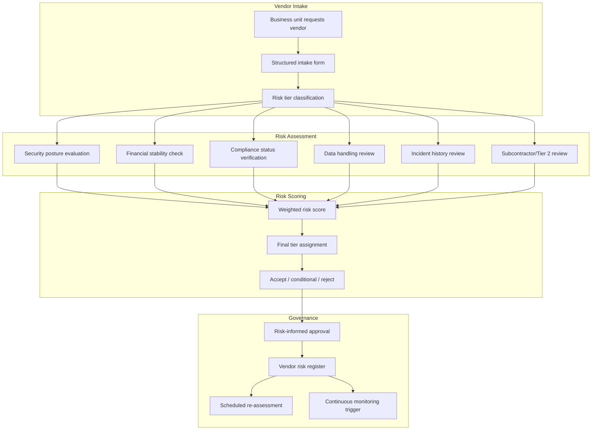

# Vendor Risk Assessment Framework Pack

> Intake, classify, score, and govern every third-party vendor before they touch your environment — because a vendor you haven't vetted is a door you haven't locked

---

## Start Here

| You Are | Read This First |
|---------|----------------|
| **Hiring Manager** | This README then [`expected-vs-observed.md`](docs/expected-vs-observed.md) — proves vendor risk governance is operational, not a spreadsheet exercise |
| **Consulting Client** | [`expected-vs-observed.md`](docs/expected-vs-observed.md) — if you can't tell me the risk tier of every vendor with access to your data, the gap is your engagement |
| **Auditor / GRC** | [`expected-vs-observed.md`](docs/expected-vs-observed.md) then [`control-mapping.md`](docs/control-mapping.md) — NIST 800-161, SA-4, SA-9, SR alignment |
| **Defense Contractor** | This is your CMMC supplier risk evidence. Start here, then [`supply-chain-scrm-packs/02`](../02-attestation-validation/) for third-party report validation |
| **Engineer** | [`/code/`](code/) for assessment templates and scoring logic then [`vra-operations-runbook.md`](docs/vra-operations-runbook.md) |

---

## The Problem

Every organization has vendors. Most organizations have a spreadsheet.

A spreadsheet is not governance. A questionnaire sent once and filed is not risk management. A vendor's self-attestation that they are "SOC 2 compliant" is not evidence — it is a claim, and claims without proof are wishes.

In a physical supply chain, you would never install a part from an unvetted manufacturer into a mission-critical assembly. You would inspect it, test it, trace its origin, and document the decision. The digital supply chain demands the same discipline.

This pack builds that discipline. Every vendor that touches your data, your infrastructure, or your users goes through a structured intake, gets classified by risk tier, receives a quantified risk score, and is either approved with evidence or rejected with justification. No exceptions. No shortcuts. No "we'll get to it later."

---

## What This Pack Delivers

| Capability | What It Does | How |
|-----------|-------------|-----|
| **Vendor intake** | Structured onboarding for every new third-party relationship | Intake form with mandatory fields: data access, integration type, business criticality |
| **Risk classification** | Tier every vendor by impact to your organization | 4-tier model: Critical, High, Medium, Low based on data access + integration depth + business dependency |
| **Risk scoring** | Quantify vendor risk with a repeatable, defensible methodology | Weighted scoring across 6 domains: security posture, financial stability, compliance status, data handling, incident history, subcontractor risk |
| **Approval workflow** | No vendor proceeds without documented risk-informed approval | Tiered approval: Critical → CISO + Legal, High → Security Lead, Medium → IT Manager, Low → Auto-approve with documentation |
| **Ongoing governance** | Vendors don't get vetted once and forgotten | Re-assessment cadence by tier: Critical (quarterly), High (semi-annual), Medium (annual), Low (biennial) |

---

## Architecture

---

## Vendor Risk Tiers

| Tier | Criteria | Examples | Assessment Depth | Re-Assessment |
|------|----------|---------|-----------------|---------------|
| **Critical** | Direct access to production data or infrastructure. Business cannot operate without vendor. Single point of failure. | Cloud IaaS/PaaS provider, ERP vendor, identity provider, primary SaaS platform | Full 6-domain assessment + Tier 2 subcontractor review + on-site/virtual audit | Quarterly |
| **High** | Access to sensitive data or significant integration. Business impact if vendor fails. | Security tools, HR/payroll SaaS, CRM with PII, backup provider | Full 6-domain assessment + attestation validation (Pack 02) | Semi-annual |
| **Medium** | Limited data access. Business can operate with alternatives. | Project management tools, communication platforms, marketing analytics | Abbreviated assessment: security posture + compliance + data handling | Annual |
| **Low** | No data access. No integration. Commodity service. | Office supplies, facilities vendors, non-integrated utilities | Self-attestation accepted with spot verification | Biennial |

---

## Risk Scoring Model

Six domains. Each weighted by impact. Total score 0-100.

| Domain | Weight | What It Measures |
|--------|--------|-----------------|
| **Security Posture** | 30% | Controls maturity, encryption, access management, vulnerability management, pen test results |
| **Compliance Status** | 20% | SOC 2, ISO 27001, CMMC, FedRAMP — not claimed, verified (Pack 02) |
| **Data Handling** | 20% | What data they access, where it's stored, how it's encrypted, retention and disposal |
| **Financial Stability** | 10% | Can they survive 12 months? Publicly traded = financials available. Private = request evidence. |
| **Incident History** | 10% | Past breaches, response quality, disclosure transparency, repeat patterns |
| **Subcontractor Risk** | 10% | Who are their vendors? Tier 2/3 visibility. If they can't answer, that's a finding. |

### Score Thresholds

| Score Range | Decision | Action |
|-------------|----------|--------|
| 80-100 | **Accept** | Approve with standard monitoring |
| 60-79 | **Conditional Accept** | Approve with compensating controls and elevated monitoring |
| 40-59 | **Elevated Review** | Requires CISO review. Compensating controls mandatory. Shorter re-assessment cycle. |
| 0-39 | **Reject** | Do not proceed. If business-critical, escalate to executive with documented risk acceptance. |

> **Watchstander Note:** A score of 42 with an executive risk acceptance is more honest than a score of 78 that nobody questioned. The scoring model is not a gate — it is a lens. The decision belongs to the business. The evidence belongs to the record.

---

## Compliance Mapping

| Framework | Control ID | Control Name | Implementation |
|-----------|-----------|--------------|----------------|
| NIST 800-161 | SR-1 | Supply Chain Risk Management Policy | Vendor risk assessment framework and tier model |
| NIST 800-161 | SR-3 | Supply Chain Controls and Processes | 6-domain scoring with re-assessment cadence |
| NIST 800-161 | SR-5 | Acquisition Strategies, Tools, and Methods | Structured intake with risk-informed approval |
| NIST 800-161 | SR-6 | Supplier Assessments and Reviews | Tiered assessment depth by risk classification |
| NIST 800-53 | SA-4 | Acquisition Process | Security requirements in vendor selection |
| NIST 800-53 | SA-9 | External System Services | Third-party risk evaluation and monitoring |
| NIST 800-53 | SA-9(2) | Identification of Functions/Ports/Protocols | Integration scope documented during intake |
| CMMC L2 | SR.L2-3.17.1 | Supply Chain Risk Management Plan | This pack + vendor register |
| ISO 27036-2 | Clause 6 | Supplier relationship management | Risk-based supplier governance |

> Full mapping: [`docs/control-mapping.md`](docs/control-mapping.md)

---

## What's Included

### `code/` — Templates, Scoring, and Automation

| File | Description |
|------|-------------|
| `vendor-intake-form.json` | Structured intake with mandatory fields by tier |
| `risk-scoring-model.json` | 6-domain weighted scoring with thresholds |
| `vendor-risk-register.json` | Register template: vendor, tier, score, approval, re-assessment date |
| `vendor-reassessment-scan.kql` | KQL: vendors past re-assessment due date |
| `deploy-vendor-governance.ps1` | PowerShell: initialize SharePoint list + Power Automate approval flow |

### `docs/` — SOPs, Runbooks, Evidence

| File | Description |
|------|-------------|
| [`expected-vs-observed.md`](docs/expected-vs-observed.md) | The Law of Evidence — 10 controls |
| [`vra-operations-runbook.md`](docs/vra-operations-runbook.md) | Full vendor risk assessment SOP |
| [`control-mapping.md`](docs/control-mapping.md) | NIST 800-161 / 800-53 / CMMC / ISO alignment |

### `screenshots/` — Evidence

This pack uses **deterministic engine outputs** as primary evidence rather than portal screenshots.

| Evidence Type | Format | Purpose |
|--------------|--------|---------|
| Engine output (`.txt`) | Script terminal output | Primary — proves logic and methodology |
| Report output (`.md`) | Formatted engine report | Primary — proves analysis and findings |
| Portal screenshot (`.png`) | Azure portal capture | Secondary — added when running against live environment |

> See `EVIDENCE-README.md` in the screenshots directory for the full evidence approach.

---

## Deployment Guide

| Step | Action | Duration |
|------|--------|----------|
| 1 | Define organizational risk appetite and scoring thresholds | 2 hours |
| 2 | Customize intake form fields for your industry | 1 hour |
| 3 | Inventory existing vendors (start with those touching data) | 4 hours |
| 4 | Classify all existing vendors by tier | 2 hours |
| 5 | Assess Critical and High vendors first (6-domain) | 2-4 hours per vendor |
| 6 | Build vendor risk register | 1 hour |
| 7 | Configure approval workflow (SharePoint + Power Automate or GRC tool) | 2 hours |
| 8 | Set re-assessment calendar | 30 min |
| 9 | Communicate process to business unit stakeholders | 1 hour |
| 10 | Capture screenshots and complete E-v-O | 1 hour |

> **Watchstander Note:** Step 3 is where most organizations stall. The vendor inventory is never complete on the first pass. Start with vendors that touch production data, PII, or infrastructure. Expand scope quarterly. Perfection is the enemy of progress, but progress must be documented.

---

## Related Packs

| Pack | Relationship |
|------|-------------|
| [Attestation Validation](../02-attestation-validation/) | Validates the SOC 2 and ISO reports vendors hand you |
| [SBOM](../03-sbom-governance/) | Component-level supply chain for software vendors |
| [Vendor Security Scorecard](../04-vendor-security-scorecard/) | Continuous monitoring between re-assessments |
| [Supply Chain Incident Response](../05-supply-chain-incident-response/) | When a vendor is breached, this is the playbook |
| [Tier 2/3 Traceability](../06-tier2-tier3-traceability/) | Mapping your vendors' vendors |
| [SLA Governance](../07-sla-governance/) | Enforcing contractual security obligations |
| [Vendor Offboarding](../08-vendor-offboarding/) | Severing every access path when the relationship ends |
| [Vendor/Guest vIAM](../../identity-iga-packs/06-vendor-guest-viam/) | Identity lifecycle for vendor personnel (identity pillar) |

---

## Changelog

| Version | Date | Change |
|---------|------|--------|
| 1.0.0 | 2026-02-11 | Initial release |

---

**© 2026 Stella Maris Governance LLC**

*The work speaks for itself. Stella Maris — the one light that does not drift.*

