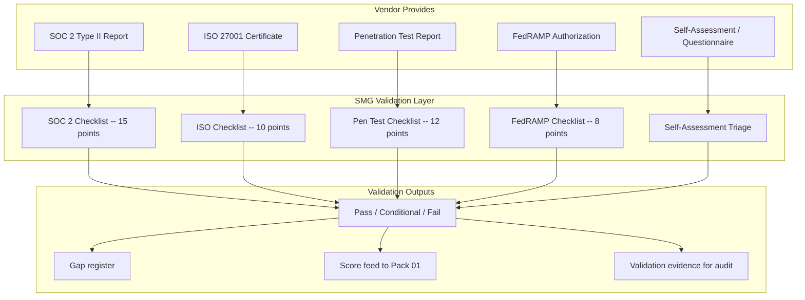

# Third-Party Attestation Validation Pack

> A vendor's claim of compliance is not evidence. A SOC 2 report on a shelf is not governance. This pack validates every attestation a vendor hands you — because to trust without verification is to be negligent.

---

## Start Here

| You Are | Read This First |
|---------|----------------|
| **Hiring Manager** | This README then [`expected-vs-observed.md`](docs/expected-vs-observed.md) — proves we actually read the reports, not just file them |
| **Consulting Client** | [`expected-vs-observed.md`](docs/expected-vs-observed.md) — when was the last time anyone in your organization actually read a vendor's SOC 2 report cover to cover? |
| **Auditor / GRC** | [`expected-vs-observed.md`](docs/expected-vs-observed.md) then [`control-mapping.md`](docs/control-mapping.md) — NIST SA-9, SR-6 alignment |
| **Defense Contractor** | This is how you validate your supply chain's compliance claims for CMMC |
| **Engineer** | [`/code/`](code/) for validation checklists and tracking then [`attestation-operations-runbook.md`](docs/attestation-operations-runbook.md) |

---

## The Problem

Every vendor you assess in Pack 01 will hand you something. A SOC 2 Type II report. An ISO 27001 certificate. A penetration test summary. A "we're FedRAMP authorized" claim. A self-assessment questionnaire they filled out in 20 minutes.

Most organizations file it. Check the box. Move on.

That is not governance. That is collection.

In a physical supply chain, you wouldn't accept a Certificate of Conformance from a parts manufacturer without verifying the lot number, inspecting the part, and confirming the cert matches the shipment. A SOC 2 report deserves the same inspection.

This pack builds the inspection. Every attestation a vendor provides is validated against a structured checklist: Is the report current? Does the scope cover the services you actually use? Are there qualified opinions, exceptions, or carve-outs? Do the controls described actually address your risk? Does the attestation match what you observe in practice?

A report that's 14 months old is expired. A SOC 2 that doesn't cover the data center you're using is irrelevant. An ISO certificate for the parent company that doesn't include the subsidiary you're contracting with is a gap. These are the findings no one looks for because no one reads the report.

We read the report.

---

## What This Pack Delivers

| Capability | What It Does | How |
|-----------|-------------|-----|
| **SOC 2 Type II validation** | Structured review of every section: scope, control descriptions, test results, exceptions, qualified opinions | 15-point validation checklist |
| **ISO 27001 certificate validation** | Verify scope, certification body accreditation, surveillance audit status, Statement of Applicability review | 10-point validation checklist |
| **Penetration test review** | Assess methodology, scope, severity of findings, remediation status, tester qualifications | 12-point validation checklist |
| **FedRAMP/StateRAMP validation** | Verify authorization level, scope, continuous monitoring status, POA&M review | 8-point validation checklist |
| **Self-assessment triage** | Determine when a self-assessment is acceptable (Low tier) vs when independent attestation is required | Tier-based acceptance criteria |
| **Attestation gap analysis** | Identify what's missing: no report, expired report, scope mismatch, unaddressed findings | Gap register with remediation tracking |

---

## Architecture

---

## Validation Checklists

### SOC 2 Type II — 15 Points

| # | Check | What You're Looking For |
|---|-------|------------------------|
| 1 | Report date | Issued within last 12 months. 12-14 months = stale. 14+ = expired. |
| 2 | Observation period | Covers at least 6 months. Shorter = limited assurance. |
| 3 | Auditor identity | Reputable CPA firm. Verify AICPA membership. |
| 4 | Scope of services | Does the scope cover the specific services you use? If they have 4 products and your product isn't named, the report is irrelevant. |
| 5 | Trust service criteria | Which criteria are covered? Security is baseline. Availability, Confidentiality, Processing Integrity, Privacy — are the ones you need included? |
| 6 | Subservice organizations | Are any components carved out? If your vendor's data center is carved out, that's a gap in the chain. |
| 7 | Control descriptions | Do the controls described address your specific risks? Generic controls don't equal relevant controls. |
| 8 | Test of operating effectiveness | Did the auditor actually test the controls, or just describe them? Type I = described. Type II = tested. You need Type II. |
| 9 | Exceptions noted | Are there exceptions in the test results? How many? How material? Were they remediated? |
| 10 | Qualified opinions | Any qualified or adverse opinions? A qualified opinion means the auditor found something significant. |
| 11 | Complementary user entity controls (CUECs) | What is the vendor expecting YOU to do? CUECs are controls the vendor assumes you have. If you don't, the vendor's control environment has a dependency gap. |
| 12 | Management response to exceptions | Did management acknowledge and remediate, or explain away? |
| 13 | Consistency with prior year | If you have last year's report, did new exceptions appear? Did old ones persist? |
| 14 | Data residency | Where is data stored? Does it match your regulatory requirements? |
| 15 | Bridging letter | If the report period doesn't cover today, is there a bridging letter attesting no material changes? |

### ISO 27001 — 10 Points

| # | Check | What You're Looking For |
|---|-------|------------------------|
| 1 | Certificate validity | Current and not expired. ISO certs are typically 3 years with annual surveillance. |
| 2 | Certification body | Accredited by a recognized body (UKAS, ANAB, etc.). Unaccredited certs are not trustworthy. |
| 3 | Scope statement | Does the scope cover the services and locations relevant to you? |
| 4 | Statement of Applicability (SoA) | Request it. The SoA shows which Annex A controls apply and which are excluded with justification. Exclusions matter. |
| 5 | Surveillance audit status | Has the most recent surveillance audit been completed? Any nonconformities? |
| 6 | Major nonconformities | Any open major nonconformities? These must be resolved within a defined timeframe or the cert is at risk. |
| 7 | Minor nonconformities | How many? Are they being tracked? A pattern of minor nonconformities signals systemic weakness. |
| 8 | Transition to ISO 27001:2022 | Have they transitioned from the 2013 version? Deadline was October 2025. |
| 9 | Integration with other standards | ISO 27017 (cloud), 27018 (PII), 27701 (privacy) — do they hold relevant extensions? |
| 10 | Certificate suspension or withdrawal history | Has the cert ever been suspended? Check the certification body's public registry. |

### Penetration Test — 12 Points

| # | Check | What You're Looking For |
|---|-------|------------------------|
| 1 | Test date | Within last 12 months. Annual testing is standard. |
| 2 | Tester qualifications | OSCP, CREST, or equivalent. Internal tests by the vendor's own team are not independent. |
| 3 | Scope | What was tested? External only? Internal? Web app? API? Mobile? If your attack surface isn't in scope, the test doesn't cover you. |
| 4 | Methodology | OWASP, PTES, or equivalent. Ad hoc testing without methodology is not a pen test. |
| 5 | Critical findings | Any critical or high-severity findings? |
| 6 | Remediation status | Were critical/high findings remediated? Is there evidence of re-test? |
| 7 | Open findings | How many findings remain open? What severity? What's the remediation timeline? |
| 8 | Social engineering | Was social engineering in scope? If not, the human layer is untested. |
| 9 | Retesting evidence | Were remediated findings verified by re-test, or just marked closed? |
| 10 | Executive summary vs full report | Did they give you the executive summary or the full technical report? The summary hides detail. Request the full report for Critical/High vendors. |
| 11 | Scope limitations | Were any systems excluded? Why? Exclusions in a pen test are potential blind spots. |
| 12 | Comparison to prior year | New findings in the same categories as last year? That's a pattern, not an incident. |

---

## Attestation Acceptance by Vendor Tier

| Vendor Tier | Minimum Attestation Required |
|------------|------------------------------|
| **Critical** | SOC 2 Type II (validated) + annual pen test (full report) + financial attestation. ISO 27001 or FedRAMP if applicable. Tier 2 subcontractor attestations requested. |
| **High** | SOC 2 Type II (validated) OR ISO 27001 (validated) + pen test summary. Self-assessment not acceptable. |
| **Medium** | SOC 2 Type II or ISO 27001 accepted. Pen test summary accepted. Self-assessment acceptable if supplemented by one independent attestation. |
| **Low** | Self-assessment accepted with spot verification. No independent attestation required. |

> **Watchstander Note:** A vendor's tier determines the inspection depth, not the vendor's preference. A Critical vendor who only provides a self-assessment questionnaire has not met the minimum. That's a finding in Pack 01, and the Compliance Status domain score drops accordingly. The math handles the consequence.

---

## Compliance Mapping

| Framework | Control ID | Control Name | Implementation |
|-----------|-----------|--------------|----------------|
| NIST 800-161 | SR-6 | Supplier Assessments and Reviews | Structured attestation validation by report type |
| NIST 800-53 | SA-9 | External System Services | Third-party control verification |
| NIST 800-53 | SA-9(2) | Identification of Functions | Scope validation in attestation review |
| NIST 800-53 | SA-4 | Acquisition Process | Attestation requirements defined by tier |
| CMMC L2 | SR.L2-3.17.1 | Supply Chain Risk Management | Vendor compliance verification |
| ISO 27036-2 | 6.3 | Supplier monitoring | Attestation review as ongoing governance |

> Full mapping: [`docs/control-mapping.md`](docs/control-mapping.md)

---

## What's Included

### `code/` — Checklists, Tracking, and Automation

| File | Description |
|------|-------------|
| `soc2-validation-checklist.json` | 15-point SOC 2 Type II validation template |
| `iso27001-validation-checklist.json` | 10-point ISO 27001 validation template |
| `pentest-validation-checklist.json` | 12-point penetration test validation template |
| `attestation-tracker.json` | Register: vendor, report type, validation status, expiry, gaps |
| `attestation-expiry-scan.kql` | KQL: attestations expiring within 60 days |
| `validate-attestation-completeness.py` | Python: check all vendors have required attestations by tier |

### `docs/` — SOPs, Runbooks, Evidence

| File | Description |
|------|-------------|
| [`expected-vs-observed.md`](docs/expected-vs-observed.md) | The Law of Evidence — 10 controls |
| [`attestation-operations-runbook.md`](docs/attestation-operations-runbook.md) | Full attestation validation SOP |
| [`control-mapping.md`](docs/control-mapping.md) | NIST 800-161 / 800-53 / CMMC / ISO alignment |

### `screenshots/` — Evidence

This pack uses **deterministic engine outputs** as primary evidence rather than portal screenshots.

| Evidence Type | Format | Purpose |
|--------------|--------|---------|
| Engine output (`.txt`) | Script terminal output | Primary — proves logic and methodology |
| Report output (`.md`) | Formatted engine report | Primary — proves analysis and findings |
| Portal screenshot (`.png`) | Azure portal capture | Secondary — added when running against live environment |

> See `EVIDENCE-README.md` in the screenshots directory for the full evidence approach.

---

## Deployment Guide

| Step | Action | Duration |
|------|--------|----------|
| 1 | Collect all existing vendor attestation reports | 4 hours |
| 2 | Log each report in attestation tracker (type, date, expiry) | 2 hours |
| 3 | Validate Critical vendor reports first (15-point SOC 2 checklist) | 2-3 hours per report |
| 4 | Validate High vendor reports | 1-2 hours per report |
| 5 | Identify gaps: missing reports, expired reports, scope mismatches | 2 hours |
| 6 | Feed validation results back to Pack 01 Compliance Status domain | 1 hour |
| 7 | Set attestation renewal calendar with 60-day advance warning | 30 min |
| 8 | Map CUECs to your own control environment | 2 hours |
| 9 | Communicate findings to vendor relationship owners | 1 hour |
| 10 | Capture screenshots and complete E-v-O | 1 hour |

> **Watchstander Note:** Step 8 is where most organizations discover uncomfortable truths. CUECs are the controls the vendor assumes you have in place. If you don't have them, the vendor's control environment has a dependency gap that neither of you is governing. Map them. Own them. Or accept the risk and document it.

---

## Related Packs

| Pack | Relationship |
|------|-------------|
| [Vendor Risk Assessment](../01-vendor-risk-assessment/) | Pack 01 identifies vendors; Pack 02 validates their claims |
| [SBOM Governance](../03-sbom-governance/) | SBOM validates software components; this pack validates organizational controls |
| [Vendor Security Scorecard](../04-vendor-security-scorecard/) | Scorecard monitors between attestation cycles |
| [Tier 2/3 Traceability](../06-tier2-tier3-traceability/) | Subservice org carve-outs in SOC 2 feed Tier 2 visibility gaps |

---

## Changelog

| Version | Date | Change |
|---------|------|--------|
| 1.0.0 | 2026-02-11 | Initial release |

---

**© 2026 Stella Maris Governance LLC**

*The work speaks for itself. Stella Maris — the one light that does not drift.*

