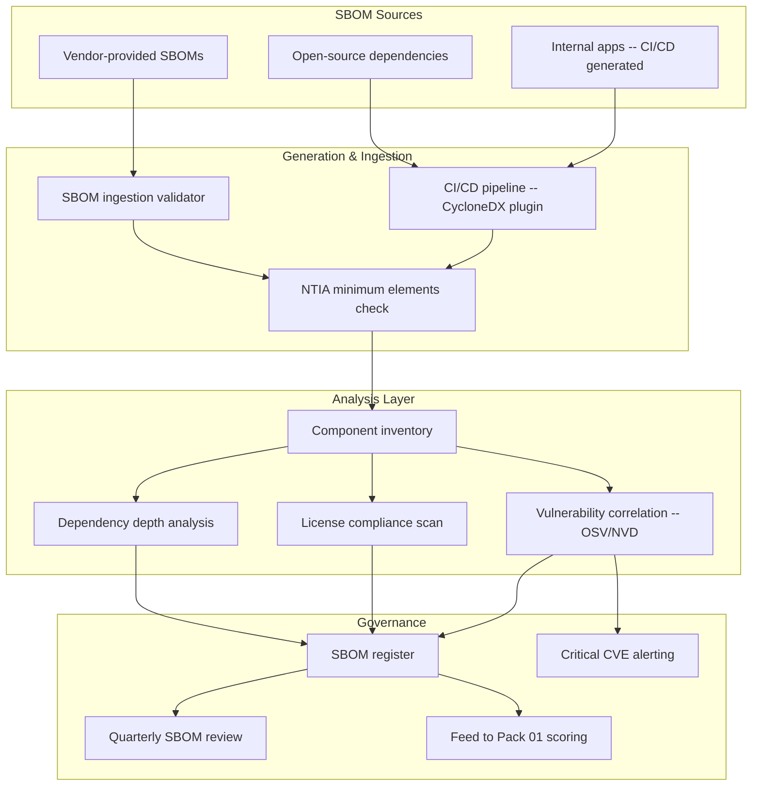

# Software Bill of Materials (SBOM) Governance Pack

> You wouldn't install an unidentified part into a jet engine. An SBOM is the parts manifest for your software supply chain — every component identified, every dependency traced, every vulnerability accounted for.

---

## Start Here

| You Are | Read This First |
|---------|----------------|
| **Hiring Manager** | This README then [`expected-vs-observed.md`](docs/expected-vs-observed.md) — proves software component governance is operational, not a checkbox |
| **Consulting Client** | [`expected-vs-observed.md`](docs/expected-vs-observed.md) — if you can't name every open-source library in your production stack, the gap is your engagement |
| **Auditor / GRC** | [`expected-vs-observed.md`](docs/expected-vs-observed.md) then [`control-mapping.md`](docs/control-mapping.md) — NIST SR-4, EO 14028, NTIA minimum elements |
| **Defense Contractor** | CMMC + EO 14028 require software supply chain visibility. This is the evidence. |
| **Engineer** | [`/code/`](code/) for SBOM generation, ingestion, and vulnerability correlation then [`sbom-operations-runbook.md`](docs/sbom-operations-runbook.md) |

---

## The Problem

Modern software doesn't get built. It gets assembled.

A typical enterprise application contains hundreds of open-source libraries, each with their own dependencies, each maintained by different teams, each with their own vulnerability timelines. When Log4Shell hit in December 2021, most organizations couldn't answer a simple question: "Do we use Log4j, and where?"

That question is a supply chain question. In aerospace, every bolt in an assembly has a lot number, a manufacturer, a material certificate, and a traceability record. If a bolt fails, you can trace it back to the mill that forged the steel. Software deserves the same discipline.

An SBOM is the parts manifest. It lists every component, every version, every license, and every known vulnerability. Without it, your software stack is an assembly built from unidentified parts — and you're trusting that none of them are counterfeit.

**Executive Order 14028** made SBOMs a federal requirement. NIST 800-161 made them a supply chain risk management control. But the mandate doesn't matter as much as the logic: you cannot govern what you cannot see.

---

## What This Pack Delivers

| Capability | What It Does | How |
|-----------|-------------|-----|
| **SBOM generation** | Produce SBOMs for internally developed applications | CycloneDX and SPDX format generation via CI/CD pipeline |
| **SBOM ingestion** | Collect and parse SBOMs from vendors | Structured ingestion process with NTIA minimum element validation |
| **Component inventory** | Centralized registry of all software components across the organization | SBOM aggregation into component database |
| **Vulnerability correlation** | Map components to known CVEs | OSV, NVD, and GitHub Advisory Database correlation |
| **License compliance** | Identify license obligations and conflicts | License classification: permissive, copyleft, commercial, unknown |
| **Dependency depth analysis** | Trace transitive dependencies — the dependencies of your dependencies | Dependency tree analysis with depth tracking |

---

## Architecture

---

## NTIA Minimum Elements

Executive Order 14028 established NTIA minimum elements for SBOMs. Every SBOM — internal or vendor-provided — must include:

| Element | Description | Validation |
|---------|-------------|------------|
| **Supplier name** | Who produced the component | Required. "Unknown" is a finding. |
| **Component name** | Name of the software component | Required. |
| **Version** | Specific version identifier | Required. "Latest" is not a version. |
| **Unique identifier** | CPE, PURL, or SWID tag | Required for vulnerability correlation. |
| **Dependency relationship** | What depends on what | Required. Flat lists without relationships are incomplete. |
| **Author of SBOM** | Who generated this SBOM | Required. |
| **Timestamp** | When the SBOM was generated | Required. SBOMs without timestamps are undated assertions. |

> **Watchstander Note:** An SBOM missing any NTIA element is an incomplete manifest. In aerospace, an incomplete parts list grounds the aircraft. The same standard applies here. Validate before you ingest.

---

## SBOM Formats

| Format | Standard | Use Case |
|--------|----------|----------|
| **CycloneDX** | OWASP | Preferred for security-focused SBOM. Native vulnerability and license fields. JSON and XML. |
| **SPDX** | Linux Foundation / ISO 5962 | Preferred for license compliance. ISO standard. Strong in open-source ecosystems. |
| **SWID** | ISO/IEC 19770-2 | Software identification tags. Less common for full SBOM but used in asset management. |

**SMG standard:** CycloneDX JSON as primary format. SPDX accepted from vendors. Conversion tooling available for cross-format ingestion.

---

## Vulnerability Correlation

When an SBOM is ingested, every component is checked against:

| Source | What It Provides | Update Cadence |
|--------|-----------------|----------------|
| **OSV (Open Source Vulnerabilities)** | Google-maintained, covers all ecosystems | Continuous |
| **NVD (National Vulnerability Database)** | NIST-maintained, CVE authority | Daily |
| **GitHub Advisory Database** | Developer-focused, covers npm, PyPI, Maven, etc. | Continuous |

### Severity Response

| CVE Severity | Response | SLA |
|-------------|----------|-----|
| **Critical (CVSS 9.0-10.0)** | Immediate assessment. Patch or mitigate within 48 hours. Escalate to CISO if in production. | 48 hours |
| **High (CVSS 7.0-8.9)** | Assess within 1 week. Patch in next maintenance window. | 7 days |
| **Medium (CVSS 4.0-6.9)** | Track and patch in next release cycle. | 30 days |
| **Low (CVSS 0.1-3.9)** | Track. Patch at convenience or accept risk. | 90 days |

> **Watchstander Note:** A critical CVE in a component you don't use is noise. A medium CVE in a component that handles authentication is a fire. Severity alone doesn't determine response — context does. The SBOM gives you the context.

---

## Vendor SBOM Requirements

| Vendor Tier (Pack 01) | SBOM Requirement |
|----------------------|------------------|
| **Critical** | SBOM required in CycloneDX or SPDX format. NTIA minimum elements validated. Updated with every major release. |
| **High** | SBOM requested. If not provided, document gap and elevate Subcontractor Risk score in Pack 01. |
| **Medium** | SBOM requested but not required. Self-declaration of major open-source components accepted. |
| **Low** | No SBOM requirement. |

---

## Compliance Mapping

| Framework | Control ID | Control Name | Implementation |
|-----------|-----------|--------------|----------------|
| EO 14028 | Sec 4(e) | Software Bill of Materials | SBOM generation, ingestion, and governance |
| NIST 800-161 | SR-4 | Provenance | Component-level traceability via SBOM |
| NIST 800-161 | SR-4(1) | Identity | Unique identifiers (CPE/PURL) for all components |
| NIST 800-161 | SR-4(2) | Track and Tracing | Dependency relationship mapping |
| NIST 800-53 | SA-4(10) | Use of Approved PIV Products | Software component approval via SBOM review |
| NIST 800-53 | CM-8 | Information System Component Inventory | SBOM as software component inventory |
| NIST 800-53 | RA-5 | Vulnerability Monitoring and Scanning | CVE correlation against SBOM components |
| CMMC L2 | SA.L2-3.16.3 | Supply Chain Protection | Software component provenance |

> Full mapping: [`docs/control-mapping.md`](docs/control-mapping.md)

---

## What's Included

### `code/` — Generation, Validation, and Correlation

| File | Description |
|------|-------------|
| `generate-sbom-cyclonedx.sh` | Shell: generate CycloneDX SBOM from project directory |
| `validate-ntia-elements.py` | Python: validate SBOM against NTIA minimum elements |
| `correlate-vulnerabilities.py` | Python: check SBOM components against OSV database |
| `sbom-register.json` | Register: application/vendor, SBOM format, date, component count, CVE summary |
| `sbom-ingestion-scan.kql` | KQL: SBOMs approaching quarterly review or missing from Critical vendors |
| `license-classifier.py` | Python: classify component licenses as permissive/copyleft/commercial/unknown |

### `docs/` — SOPs, Runbooks, Evidence

| File | Description |
|------|-------------|
| [`expected-vs-observed.md`](docs/expected-vs-observed.md) | The Law of Evidence — 10 controls |
| [`sbom-operations-runbook.md`](docs/sbom-operations-runbook.md) | Full SBOM governance SOP |
| [`control-mapping.md`](docs/control-mapping.md) | EO 14028 / NIST 800-161 / 800-53 / CMMC alignment |

### `screenshots/` — Evidence

This pack uses **deterministic engine outputs** as primary evidence rather than portal screenshots.

| Evidence Type | Format | Purpose |
|--------------|--------|---------|
| Engine output (`.txt`) | Script terminal output | Primary — proves logic and methodology |
| Report output (`.md`) | Formatted engine report | Primary — proves analysis and findings |
| Portal screenshot (`.png`) | Azure portal capture | Secondary — added when running against live environment |

> See `EVIDENCE-README.md` in the screenshots directory for the full evidence approach.

---

## Deployment Guide

| Step | Action | Duration |
|------|--------|----------|
| 1 | Inventory internal applications and vendor software in production | 4 hours |
| 2 | Integrate CycloneDX plugin into CI/CD pipeline for internal apps | 2 hours |
| 3 | Request SBOMs from Critical and High vendors | 1 hour (request), weeks (vendor response) |
| 4 | Validate received SBOMs against NTIA minimum elements | 1 hour per SBOM |
| 5 | Run vulnerability correlation against OSV/NVD | 1 hour |
| 6 | Run license classification | 30 min |
| 7 | Build SBOM register with component counts and CVE summary | 2 hours |
| 8 | Set quarterly SBOM review calendar for Critical vendors | 30 min |
| 9 | Establish critical CVE notification workflow | 1 hour |
| 10 | Capture screenshots and complete E-v-O | 1 hour |

> **Watchstander Note:** Step 3 is where friction lives. Most vendors have never been asked for an SBOM. Some will say they don't have one. Some will say it's proprietary. Document every response. A vendor who cannot produce an SBOM for their own product doesn't know what's in their own assembly. That's a finding — and it feeds Pack 01 scoring.

---

## Related Packs

| Pack | Relationship |
|------|-------------|
| [Vendor Risk Assessment](../01-vendor-risk-assessment/) | Vendor tier determines SBOM requirement level |
| [Attestation Validation](../02-attestation-validation/) | Pack 02 validates organizational controls; Pack 03 validates software components |
| [Vendor Security Scorecard](../04-vendor-security-scorecard/) | SBOM vulnerability data feeds continuous scorecard |
| [Supply Chain Incident Response](../05-supply-chain-incident-response/) | SBOM enables rapid impact assessment when a CVE drops |
| [Tier 2/3 Traceability](../06-tier2-tier3-traceability/) | Transitive dependencies are the software equivalent of Tier 2/3 suppliers |

---

## Changelog

| Version | Date | Change |
|---------|------|--------|
| 1.0.0 | 2026-02-11 | Initial release |

---

**© 2026 Stella Maris Governance LLC**

*The work speaks for itself. Stella Maris — the one light that does not drift.*

