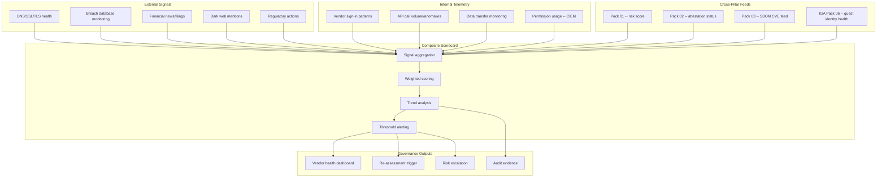

# Vendor Security Scorecard Pack

> A re-assessment every quarter is a photograph. A scorecard is a surveillance camera. This pack monitors your vendors continuously between assessment cycles — because threats don't wait for your review calendar.

---

## Start Here

| You Are | Read This First |
|---------|----------------|
| **Hiring Manager** | This README then [`expected-vs-observed.md`](docs/expected-vs-observed.md) — proves vendor monitoring is continuous, not calendar-driven |
| **Consulting Client** | [`expected-vs-observed.md`](docs/expected-vs-observed.md) — when was the last time you checked a vendor's security posture between annual reviews? |
| **Auditor / GRC** | [`expected-vs-observed.md`](docs/expected-vs-observed.md) then [`control-mapping.md`](docs/control-mapping.md) — NIST SR-6, SA-9 continuous monitoring alignment |
| **Defense Contractor** | Continuous vendor monitoring is a CMMC expectation. This is the evidence. |
| **Engineer** | [`/code/`](code/) for scorecard logic and alert configuration then [`scorecard-operations-runbook.md`](docs/scorecard-operations-runbook.md) |

---

## The Problem

Pack 01 assessed the vendor. Pack 02 validated their paperwork. Pack 03 inspected their code. All of that happened at a point in time.

But vendors don't freeze between your assessments. They get breached. They lose key personnel. Their financial stability deteriorates. Their SSL certificates expire. Their DNS gets hijacked. Their code repositories get compromised. Their subprocessors change. Their compliance certifications lapse.

If your only visibility into vendor risk is the quarterly re-assessment, you're flying blind for 89 days out of every 90.

In a physical supply chain, you don't inspect a manufacturer once and trust them forever. You monitor incoming shipment quality, track defect rates, watch for supplier financial distress signals, and respond when a recall is issued. The digital supply chain demands the same continuous watch.

This pack builds the surveillance. Every vendor gets a living scorecard — fed by external signals, internal telemetry, and cross-pillar data from the SMG ecosystem. The scorecard doesn't replace the assessment. It watches between assessments.

---

## What This Pack Delivers

| Capability | What It Does | How |
|-----------|-------------|-----|
| **External signal monitoring** | Track publicly observable vendor security indicators | DNS health, SSL/TLS status, exposed services, breach databases, dark web mentions |
| **Financial signal monitoring** | Watch for vendor financial distress | News monitoring, SEC filings (public companies), layoff trackers, funding round data |
| **Compliance signal monitoring** | Detect attestation lapses between assessments | Certificate expiry (from Pack 02), FedRAMP continuous monitoring status, regulatory actions |
| **SBOM vulnerability feed** | Continuous CVE correlation for vendor software | From Pack 03 — new CVEs in vendor components trigger scorecard impact |
| **Internal telemetry** | Monitor vendor behavior in your environment | Sign-in patterns, API call volumes, data transfer anomalies, permission usage |
| **Composite scorecard** | Single dashboard view of vendor health across all signal categories | Weighted composite with trend analysis and threshold alerting |

---

## Architecture

---

## Scorecard Signal Categories

### Category 1 — External Security Posture (30%)

| Signal | Source | Check Cadence | What Triggers a Score Drop |
|--------|--------|--------------|---------------------------|
| SSL/TLS certificate validity | Certificate Transparency logs | Daily | Certificate expired, weak cipher suite, certificate transparency anomaly |
| DNS configuration | DNS lookups | Daily | SPF/DKIM/DMARC missing, DNS hijack indicators, dangling CNAME |
| Exposed services | Shodan/Censys | Weekly | Unexpected open ports, exposed admin panels, unpatched services |
| Breach database presence | HaveIBeenPwned, breach aggregators | Daily | Vendor domain appears in new breach dataset |
| Dark web mentions | Dark web monitoring feed | Weekly | Vendor credentials, data, or infrastructure references on dark web |

### Category 2 — Financial Health (15%)

| Signal | Source | Check Cadence | What Triggers a Score Drop |
|--------|--------|--------------|---------------------------|
| Public company filings | SEC EDGAR (public) | Quarterly | Revenue decline > 15%, going concern opinion, material weakness |
| Funding/layoff signals | News monitoring | Weekly | Mass layoffs (> 20%), failed funding round, acquisition rumors |
| Burn rate trend | Pack 01 financial data | Quarterly | Burn rate exceeds 30% threshold (Pack 01 flag) |
| Payment behavior | AP/AR data (if available) | Monthly | Vendor invoicing irregularities, payment demands acceleration |

### Category 3 — Compliance Currency (20%)

| Signal | Source | Check Cadence | What Triggers a Score Drop |
|--------|--------|--------------|---------------------------|
| Attestation expiry | Pack 02 tracker | Weekly | SOC 2/ISO/pen test approaching or past expiry |
| FedRAMP/StateRAMP status | Marketplace | Monthly | Authorization revoked, POA&M delinquent |
| Regulatory action | Federal/state regulator feeds | Weekly | GDPR fine, FTC action, state AG investigation |
| SBOM vulnerability load | Pack 03 CVE feed | Daily | New critical CVE in vendor SBOM components |

### Category 4 — Internal Behavior (20%)

| Signal | Source | Check Cadence | What Triggers a Score Drop |
|--------|--------|--------------|---------------------------|
| Sign-in anomalies | Entra sign-in logs / ITDR Pack 09 | Continuous | Vendor accounts signing in from unusual locations, times, or devices |
| API call anomalies | API gateway logs | Daily | Call volume > 3x baseline, new endpoints accessed, error rate spike |
| Data transfer anomalies | DLP / network logs | Daily | Unusual data export volume, new destinations, bulk download |
| Permission usage | CIEM Pack 08 | Weekly | Vendor identity PCI score increase, unused permissions activated |

### Category 5 — Relationship Health (15%)

| Signal | Source | Check Cadence | What Triggers a Score Drop |
|--------|--------|--------------|---------------------------|
| SLA compliance | Pack 07 SLA tracker | Monthly | SLA breach pattern (3+ in quarter) |
| Responsiveness | Correspondence log | Monthly | Vendor non-responsive to security inquiries > 14 days |
| Incident cooperation | Pack 05 incident log | As needed | Vendor uncooperative during incident investigation |
| SBOM provision | Pack 03 register | Quarterly | Vendor fails to provide or refresh SBOM when required |

---

## Composite Score and Thresholds

Each vendor receives a composite score (0-100) calculated from the 5 weighted categories.

| Composite Score | Status | Action |
|----------------|--------|--------|
| 80-100 | **Healthy** | Normal monitoring cadence. No action required. |
| 60-79 | **Watch** | Elevated monitoring. Monthly review by risk owner. Investigate declining trend. |
| 40-59 | **Concern** | Trigger out-of-cycle re-assessment (Pack 01). Notify vendor relationship owner. Weekly monitoring. |
| 0-39 | **Critical** | Immediate escalation to CISO. Activate contingency planning. Consider vendor replacement timeline. |

> **Watchstander Note:** The composite score is a signal, not a sentence. A vendor at 58 with an upward trend is healthier than a vendor at 65 with a downward trend. The trend is the story. The score is the headline. Read both.

---

## Trend Analysis

Scorecard tracks 90-day rolling trend for every vendor. Trend indicators:

| Trend | Definition | Action |
|-------|-----------|--------|
| **Improving** | Score increased > 5 points over 90 days | Note in register. Positive signal. |
| **Stable** | Score within ±5 points over 90 days | Normal operations. |
| **Declining** | Score decreased > 5 points over 90 days | Investigate cause. Increase monitoring frequency. |
| **Rapid Decline** | Score decreased > 15 points over 90 days | Trigger out-of-cycle re-assessment. Escalate. |

---

## Compliance Mapping

| Framework | Control ID | Control Name | Implementation |
|-----------|-----------|--------------|----------------|
| NIST 800-161 | SR-6 | Supplier Assessments and Reviews | Continuous vendor monitoring between assessments |
| NIST 800-161 | SR-6(1) | Testing and Analysis | Ongoing signal analysis of vendor security posture |
| NIST 800-53 | SA-9 | External System Services | Continuous third-party risk monitoring |
| NIST 800-53 | CA-7 | Continuous Monitoring | Vendor scorecard as continuous monitoring mechanism |
| NIST 800-53 | RA-3 | Risk Assessment | Living risk assessment via scorecard trends |
| CMMC L2 | SR.L2-3.17.1 | Supply Chain Risk Management | Continuous vendor oversight |

> Full mapping: [`docs/control-mapping.md`](docs/control-mapping.md)

---

## What's Included

### `code/` — Scoring, Monitoring, and Alerting

| File | Description |
|------|-------------|
| `calculate-scorecard.py` | Python: composite scorecard from 5 signal categories |
| `external-signal-check.py` | Python: DNS/SSL/breach database checks for vendor domains |
| `scorecard-register.json` | Register: vendor, composite score, category scores, trend, last updated |
| `scorecard-alert-rules.json` | Alert rules: threshold breaches, rapid decline, new breach detection |
| `scorecard-trend-scan.kql` | KQL: 90-day trend analysis across all vendor scorecards |
| `deploy-scorecard-alerts.ps1` | PowerShell: configure monitoring alerts |

### `docs/` — SOPs, Runbooks, Evidence

| File | Description |
|------|-------------|
| [`expected-vs-observed.md`](docs/expected-vs-observed.md) | The Law of Evidence — 10 controls |
| [`scorecard-operations-runbook.md`](docs/scorecard-operations-runbook.md) | Full scorecard operations SOP |
| [`control-mapping.md`](docs/control-mapping.md) | NIST 800-161 / 800-53 / CMMC alignment |

### `screenshots/` — Evidence

| # | What It Shows |
|---|--------------|
| 01 | Vendor scorecard dashboard: all vendors with composite scores and trends |
| 02 | Signal detail: external posture check for a Critical vendor |
| 03 | Trend analysis: 90-day rolling trend with category breakdown |
| 04 | Alert firing: threshold breach notification |
| 05 | Cross-pillar feed: Pack 02/03 data flowing into scorecard |

---

## Deployment Guide

| Step | Action | Duration |
|------|--------|----------|
| 1 | Enumerate vendor domains for external monitoring | 1 hour |
| 2 | Configure SSL/DNS/breach monitoring for Critical and High vendors | 2 hours |
| 3 | Connect cross-pillar feeds (Pack 01 scores, Pack 02 attestation status, Pack 03 CVE feed) | 2 hours |
| 4 | Configure internal telemetry collection (sign-in logs, API logs) for vendor accounts | 2 hours |
| 5 | Build initial scorecards for all Critical and High vendors | 2 hours |
| 6 | Establish 30-day baseline before trusting trend data | 30 days (passive) |
| 7 | Configure alerting thresholds and notification routing | 1 hour |
| 8 | Set monthly scorecard review cadence | 30 min |
| 9 | Train vendor relationship owners on scorecard reading | 1 hour |
| 10 | Capture screenshots and complete E-v-O | 1 hour |

> **Watchstander Note:** Step 6 is the patience requirement. Like CIEM's PCI scores (Pack 08), scorecard trends are trailing indicators. A 30-day baseline must establish "normal" before any decline can be meaningful. Reacting to signals without a baseline is guessing. We don't guess.

---

## Related Packs

| Pack | Relationship |
|------|-------------|
| [Vendor Risk Assessment](../01-vendor-risk-assessment/) | Scorecard monitors between Pack 01 re-assessments. Score decline triggers out-of-cycle re-assessment. |
| [Attestation Validation](../02-attestation-validation/) | Attestation expiry feeds Compliance Currency category |
| [SBOM Governance](../03-sbom-governance/) | New CVEs in vendor components feed Compliance Currency |
| [Supply Chain Incident Response](../05-supply-chain-incident-response/) | Scorecard "Critical" status triggers incident response planning |
| [SLA Governance](../07-sla-governance/) | SLA breach patterns feed Relationship Health category |
| [CIEM (Identity Pack 08)](../../identity-iga-packs/08-entra-permissions-management/) | Vendor identity PCI scores feed Internal Behavior category |
| [ITDR (Identity Pack 09)](../../identity-iga-packs/09-identity-threat-detection/) | Vendor account sign-in anomalies feed Internal Behavior |

---

## Changelog

| Version | Date | Change |
|---------|------|--------|
| 1.0.0 | 2026-02-11 | Initial release |

---

**© 2026 Stella Maris Governance LLC**

*The work speaks for itself. Stella Maris — the one light that does not drift.*

