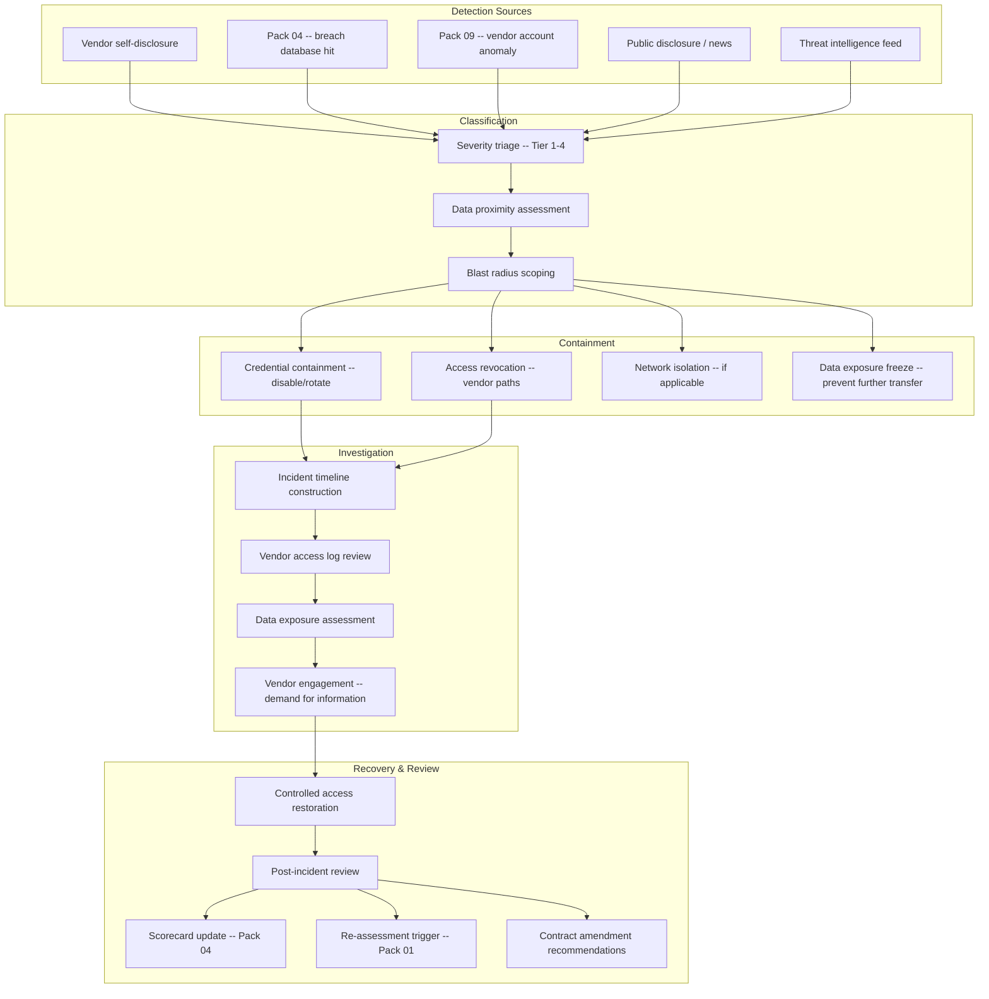

# Supply Chain Incident Response Pack

> When a vendor is breached, the clock starts in their house — but the blast radius lives in yours. This pack governs what happens in your environment when a third-party incident occurs.

---

## Start Here

| You Are | Read This First |
|---------|----------------|
| **Hiring Manager** | This README then [`expected-vs-observed.md`](docs/expected-vs-observed.md) — proves third-party incident response is tested, not theoretical |
| **Consulting Client** | [`expected-vs-observed.md`](docs/expected-vs-observed.md) — if your incident response plan only covers your own systems, you have half a plan |
| **Auditor / GRC** | [`expected-vs-observed.md`](docs/expected-vs-observed.md) then [`control-mapping.md`](docs/control-mapping.md) — NIST IR-4, IR-5, IR-6, SR-6 alignment |
| **Defense Contractor** | CMMC requires documented incident handling. This covers the third-party vector most plans ignore. |
| **Engineer** | [`/code/`](code/) for playbooks and containment scripts then [`incident-response-runbook.md`](docs/incident-response-runbook.md) |

---

## The Problem

Your incident response plan covers your infrastructure. Your ITDR (Pack 09) detects identity compromise in your environment. Your SOC watches your perimeter.

But when SolarWinds was compromised, the breach didn't start in your house. It started in theirs. When MOVEit was exploited, the vulnerability wasn't in your code. It was in your vendor's. When a vendor's employee credentials are phished and those credentials have access to your data — the incident began in their environment, but the impact lands in yours.

Most incident response plans treat third-party breaches as a notification they receive. They wait for the vendor to tell them what happened, assess the damage, and provide a timeline. That is not incident response. That is waiting.

This pack builds the response you own. When a vendor is compromised — whether they tell you or you discover it through the scorecard (Pack 04), breach database, or your own detection — you have a playbook. You contain your exposure. You assess your blast radius. You communicate with stakeholders. You document the timeline. And you hold the vendor accountable for their role.

**You cannot control the vendor's breach. You can control your response to it.**

---

## What This Pack Delivers

| Capability | What It Does | How |
|-----------|-------------|-----|
| **Third-party incident classification** | Classify vendor incidents by severity and proximity to your data | 4-tier severity model based on data exposure and blast radius |
| **Containment playbooks** | Immediate actions to limit exposure when a vendor is compromised | Playbooks by incident type: credential compromise, data breach, service outage, supply chain attack |
| **Blast radius assessment** | Determine what the vendor had access to and what may be affected | Cross-reference vendor access with identity pillar (Pack 06), CIEM (Pack 08), SBOM (Pack 03) |
| **Communication templates** | Stakeholder notification at every stage | Internal (CISO, legal, executive), external (regulator, customer), vendor (demand for information) |
| **Vendor accountability framework** | Hold the vendor to contractual obligations during and after the incident | SLA enforcement, right-to-audit activation, incident cooperation scoring |
| **Post-incident review** | Lessons learned with governance improvements | Scorecard update, re-assessment trigger, contract amendment recommendations |

---

## Architecture

---

## Incident Severity Classification

| Tier | Name | Criteria | Response SLA | Example |
|------|------|----------|-------------|---------|
| **Tier 1 — Critical** | Confirmed data exposure | Vendor breach confirmed AND your data is in the blast radius. Evidence of exfiltration or unauthorized access to your data. | Contain: 1 hour. CISO brief: 2 hours. | Vendor's database containing your PII was exfiltrated. |
| **Tier 2 — High** | Probable exposure | Vendor breach confirmed. Your data may be in the blast radius but exposure is not yet confirmed. | Contain: 4 hours. Investigation: 24 hours. | Vendor's infrastructure was compromised; your data resides on affected systems but exfiltration unconfirmed. |
| **Tier 3 — Medium** | Vendor compromised, low proximity | Vendor breach confirmed but your data is not on affected systems. Indirect risk (credential reuse, lateral movement potential). | Assessment: 24 hours. Monitoring: 7 days. | Vendor's corporate email compromised; your data is in a separate, unaffected environment. |
| **Tier 4 — Low** | Vendor incident, no proximity | Vendor reports security incident that does not involve systems or data related to your organization. | Acknowledge: 48 hours. Monitor. | Vendor's marketing site defaced; no access to your data or systems. |

> **Watchstander Note:** When a vendor calls and says "we had an incident but your data isn't affected" — that is their assessment, not yours. Until you verify independently, classify based on what you know, not what they tell you. Trust arrives with evidence.

---

## Containment Playbooks

### Playbook A — Vendor Credential Compromise

**Trigger:** Vendor account credentials (service principal, user account, API key) suspected or confirmed compromised.

| Step | Action | Owner | SLA |
|------|--------|-------|-----|
| 1 | Disable all vendor accounts in Entra ID | IAM Lead | 30 min |
| 2 | Revoke all vendor sessions | IAM Lead | 30 min |
| 3 | Rotate all shared secrets, API keys, certificates | IAM Lead + Engineering | 2 hours |
| 4 | Review vendor account activity for last 30 days (Sentinel) | SOC | 4 hours |
| 5 | Check for persistence: new app registrations, mail rules, OAuth consents | SOC | 4 hours |
| 6 | Notify vendor security team with demand for timeline | Risk Owner | 4 hours |
| 7 | Assess blast radius: what did the vendor account have access to? | IAM Lead + CIEM | 8 hours |
| 8 | Determine if data was accessed or exfiltrated | SOC + DLP | 24 hours |

### Playbook B — Vendor Data Breach

**Trigger:** Vendor reports or evidence indicates breach of systems containing your data.

| Step | Action | Owner | SLA |
|------|--------|-------|-----|
| 1 | Classify severity (Tier 1-4) | Risk Owner | 1 hour |
| 2 | Activate containment: restrict data flows to/from vendor | Engineering | 2 hours |
| 3 | Demand from vendor: scope, timeline, affected data, remediation plan | Risk Owner | 4 hours |
| 4 | Inventory all data shared with or accessible by the vendor | Data Owner | 8 hours |
| 5 | Assess regulatory notification requirements (GDPR 72-hour, state breach laws) | Legal | 8 hours |
| 6 | Prepare internal communication: CISO, executive, board (if Tier 1) | Risk Owner | 12 hours |
| 7 | Prepare customer notification (if PII/PHI affected) | Legal + Comms | 24 hours |
| 8 | Activate right-to-audit clause if vendor is non-cooperative | Legal | 48 hours |

### Playbook C — Supply Chain Software Attack

**Trigger:** Vendor's software update or component compromised (SolarWinds-type attack). Pack 03 SBOM correlation identifies affected component.

| Step | Action | Owner | SLA |
|------|--------|-------|-----|
| 1 | Identify affected component via SBOM (Pack 03) | Engineering | 1 hour |
| 2 | Isolate systems running affected version | Engineering | 2 hours |
| 3 | Block update mechanism for affected vendor software | Engineering | 2 hours |
| 4 | Roll back to last known-good version if available | Engineering | 4 hours |
| 5 | Scan for indicators of compromise from threat intelligence | SOC | 4 hours |
| 6 | Notify all internal teams consuming affected software | Risk Owner | 4 hours |
| 7 | Coordinate with vendor on clean build / verified patch | Engineering | Ongoing |
| 8 | Perform post-recovery integrity verification before re-enabling updates | Engineering | Before restore |

### Playbook D — Vendor Service Outage

**Trigger:** Critical or High vendor experiences extended outage affecting your operations.

| Step | Action | Owner | SLA |
|------|--------|-------|-----|
| 1 | Confirm outage scope and estimated recovery time | Risk Owner | 1 hour |
| 2 | Activate business continuity procedures for affected services | Business Owner | 2 hours |
| 3 | Assess whether outage is security-related (DDoS, ransomware) | SOC | 4 hours |
| 4 | If security-related: escalate to Playbook A or B | Risk Owner | Immediate |
| 5 | Document SLA breach for Pack 07 tracking | Risk Owner | 24 hours |
| 6 | Post-outage: demand root cause analysis from vendor | Risk Owner | 7 days |

---

## Blast Radius Assessment

When a vendor incident occurs, assess exposure across all pillars:

| Pillar | Assessment | Source |
|--------|-----------|--------|
| **Identity** | What accounts does the vendor have? What can they access? Were accounts active during incident window? | Pack 06 (Guest vIAM), Pack 08 (CIEM), Pack 09 (ITDR) |
| **Data** | What data does the vendor have access to? What data classification? Where is it stored? | Pack 01 intake form (data classification field) |
| **Software** | Is the vendor's software in our SBOM? What version? What are its dependencies? | Pack 03 (SBOM) |
| **Network** | Does the vendor have VPN/network access? What segments? | Network documentation |
| **Financial** | What is the vendor's financial exposure? Contract value? Liability terms? | Pack 07 (SLA), contract terms |

> **Watchstander Note:** Blast radius assessment is not a sequential process. Run all five assessments in parallel. The identity assessment tells you who was compromised. The data assessment tells you what's at risk. The software assessment tells you if the code is poisoned. You need all five answers, and you need them fast.

---

## Communication Framework

| Audience | When | What | Template |
|----------|------|------|----------|
| **CISO** | Tier 1: 2 hours. Tier 2: 8 hours. | Severity, blast radius, containment status, vendor cooperation | `comms-ciso-brief.md` |
| **Executive / Board** | Tier 1 only, within 24 hours | Business impact, customer exposure, regulatory risk, vendor accountability | `comms-exec-brief.md` |
| **Legal** | All tiers, within 8 hours | Regulatory notification requirements, contract enforcement options, liability assessment | `comms-legal-brief.md` |
| **Vendor** | All tiers, within 4 hours | Demand for information: scope, timeline, affected data, remediation plan, root cause | `comms-vendor-demand.md` |
| **Regulators** | If notification required (GDPR 72-hour, state laws) | Incident details per regulatory template | `comms-regulator-notification.md` |
| **Customers** | If PII/PHI confirmed exposed | Transparent disclosure per legal guidance | `comms-customer-notification.md` |

---

## Vendor Accountability

During and after a supply chain incident, the vendor is scored on:

| Factor | What You're Measuring | Impact |
|--------|----------------------|--------|
| **Disclosure timeliness** | How quickly did the vendor notify you? | Feeds Relationship Health (Pack 04) |
| **Transparency** | Did they share scope, timeline, and root cause? Or minimize and deflect? | Feeds Relationship Health |
| **Cooperation** | Did they respond to your demands for information? Did they grant audit access? | Feeds Relationship Health |
| **Remediation quality** | Was the fix thorough? Was root cause addressed? Did they prevent recurrence? | Feeds next Pack 01 re-assessment |
| **Contractual compliance** | Did they meet SLA and contractual notification requirements? | Feeds Pack 07 SLA tracking |

> **Watchstander Note:** A vendor who discloses quickly, cooperates fully, and remediates thoroughly is a vendor who takes security seriously — even though they had an incident. A vendor who minimizes, delays, and deflects is a vendor who treats incidents as PR problems, not security problems. The incident tells you what happened. The response tells you who they are.

---

## Compliance Mapping

| Framework | Control ID | Control Name | Implementation |
|-----------|-----------|--------------|----------------|
| NIST 800-161 | SR-6 | Supplier Assessments and Reviews | Post-incident re-assessment and scorecard update |
| NIST 800-53 | IR-4 | Incident Handling | Third-party incident playbooks with containment SLAs |
| NIST 800-53 | IR-4(10) | Supply Chain Coordination | Vendor engagement and demand for information |
| NIST 800-53 | IR-5 | Incident Monitoring | Timeline construction with timestamps |
| NIST 800-53 | IR-6 | Incident Reporting | Communication framework: internal, vendor, regulator, customer |
| NIST 800-53 | IR-8 | Incident Response Plan | Documented third-party IR plan with tested playbooks |
| CMMC L2 | IR.L2-3.6.1 | Incident Handling | Documented third-party incident response |
| CMMC L2 | IR.L2-3.6.2 | Incident Reporting | Notification chain with regulatory compliance |

> Full mapping: [`docs/control-mapping.md`](docs/control-mapping.md)

---

## What's Included

### `code/` — Playbooks, Containment, and Communication

| File | Description |
|------|-------------|
| `playbook-credential-compromise.json` | Logic App: auto-disable vendor accounts + revoke sessions |
| `playbook-data-breach-response.json` | Structured response checklist with timeline tracking |
| `blast-radius-assessment.py` | Python: cross-pillar exposure assessment from vendor ID |
| `incident-register.json` | Register: incident ID, vendor, severity, timeline, status, lessons |
| `incident-timeline-builder.kql` | KQL: reconstruct vendor activity timeline from Sentinel logs |
| `deploy-incident-playbooks.ps1` | PowerShell: deploy containment Logic Apps |

### `docs/` — SOPs, Runbooks, Communication Templates

| File | Description |
|------|-------------|
| [`expected-vs-observed.md`](docs/expected-vs-observed.md) | The Law of Evidence — 10 controls |
| [`incident-response-runbook.md`](docs/incident-response-runbook.md) | Full third-party IR operations SOP |
| [`control-mapping.md`](docs/control-mapping.md) | NIST 800-161 / 800-53 / CMMC alignment |
| [`comms-vendor-demand.md`](docs/comms-vendor-demand.md) | Vendor demand for information template |
| [`comms-ciso-brief.md`](docs/comms-ciso-brief.md) | CISO incident brief template |

### `screenshots/` — Evidence

This pack uses **deterministic engine outputs** as primary evidence rather than portal screenshots.

| Evidence Type | Format | Purpose |
|--------------|--------|---------|
| Engine output (`.txt`) | Script terminal output | Primary — proves logic and methodology |
| Report output (`.md`) | Formatted engine report | Primary — proves analysis and findings |
| Portal screenshot (`.png`) | Azure portal capture | Secondary — added when running against live environment |

> See `EVIDENCE-README.md` in the screenshots directory for the full evidence approach.

---

## Deployment Guide

| Step | Action | Duration |
|------|--------|----------|
| 1 | Inventory all vendor access paths (accounts, API keys, VPN, network) | 4 hours |
| 2 | Deploy credential containment playbook (Logic App) | 2 hours |
| 3 | Map blast radius data sources (identity, data, SBOM, network) | 2 hours |
| 4 | Create communication distribution lists (CISO, legal, exec, vendor contacts) | 1 hour |
| 5 | Customize communication templates for your organization | 2 hours |
| 6 | Configure incident register | 1 hour |
| 7 | Run tabletop exercise: simulate vendor credential compromise | 3 hours |
| 8 | Run tabletop exercise: simulate vendor data breach notification | 3 hours |
| 9 | Document tabletop results and refine playbooks | 2 hours |
| 10 | Capture screenshots and complete E-v-O | 1 hour |

> **Watchstander Note:** Steps 7 and 8 are not optional. A playbook that has never been tested is a document, not a plan. The tabletop exercises must simulate realistic scenarios: a vendor calls at 1400 and says "we've had an incident." What happens in the next 60 minutes? If the answer is "we'd figure it out," the plan isn't ready. If the answer is "Step 1, Step 2, Step 3, with these people, in this order" — the plan is ready.

---

## Related Packs

| Pack | Relationship |
|------|-------------|
| [Vendor Risk Assessment](../01-vendor-risk-assessment/) | Post-incident re-assessment triggered. Vendor cooperation scored. |
| [Attestation Validation](../02-attestation-validation/) | Post-incident: request updated attestation with incident scope |
| [SBOM Governance](../03-sbom-governance/) | Playbook C: SBOM identifies affected software components |
| [Vendor Security Scorecard](../04-vendor-security-scorecard/) | Incident triggers scorecard update. Breach database feed. |
| [Tier 2/3 Traceability](../06-tier2-tier3-traceability/) | Incident at Tier 2 supplier? Traceability determines your exposure. |
| [SLA Governance](../07-sla-governance/) | Incident notification timeliness scored against SLA |
| [Vendor Offboarding](../08-vendor-offboarding/) | If vendor relationship terminated post-incident |
| [ITDR (Identity Pack 09)](../../identity-iga-packs/09-identity-threat-detection/) | Vendor account anomalies detected by ITDR feed into incident classification |
| [CIEM (Identity Pack 08)](../../identity-iga-packs/08-entra-permissions-management/) | Blast radius assessment uses CIEM to scope vendor permissions |

---

## Changelog

| Version | Date | Change |
|---------|------|--------|
| 1.0.0 | 2026-02-11 | Initial release |

---

**© 2026 Stella Maris Governance LLC**

*The work speaks for itself. Stella Maris — the one light that does not drift.*

