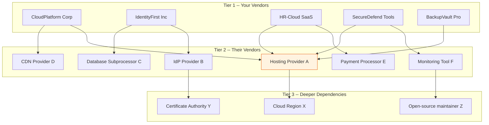

# Tier 2/3 Supplier Traceability Pack

> You vetted the vendor. But who did the vendor vet? In aerospace, a defective bolt traced back three tiers shut down a production line. In the digital supply chain, a compromised subprocessor three tiers deep is the SolarWinds lesson most organizations still haven't learned.

---

> **Governance Notice** — This pack is governed by the [Stella Maris Constitution (CONST-01)](https://github.com/stella-maris-governance/smg-enterprise-hq) and enforces **POL-SC-01 (Supply Chain) · NIST SR-3, SR-5**. All dispositions are subject to the Two-Person Integrity Protocol.

---

## Start Here

| You Are | Read This First |
|---------|----------------|
| **Hiring Manager** | This README then [`expected-vs-observed.md`](docs/expected-vs-observed.md) — proves supply chain visibility extends beyond the first tier |
| **Consulting Client** | [`expected-vs-observed.md`](docs/expected-vs-observed.md) — your vendor's vendor has access to your data. Can you name them? |
| **Auditor / GRC** | [`expected-vs-observed.md`](docs/expected-vs-observed.md) then [`control-mapping.md`](docs/control-mapping.md) — NIST SR-3, SR-4(2), SA-9(2) alignment |
| **Defense Contractor** | CMMC requires supply chain traceability. ITAR requires knowing where data flows. This is the evidence. |
| **Engineer** | [`/code/`](code/) for supply chain mapping and traceability queries then [`traceability-operations-runbook.md`](docs/traceability-operations-runbook.md) |

---

## The Problem

You assessed CloudPlatform Corp. They scored 91. They have a validated SOC 2, clean pen test, healthy scorecard.

But CloudPlatform Corp runs on infrastructure from a hosting provider you've never heard of. They use a third-party identity provider for their internal access. Their database is managed by a subprocessor in a jurisdiction you didn't evaluate. Their monitoring tool was built by a company that was acquired last quarter by an entity you wouldn't have approved.

You vetted Tier 1. But Tier 2 and Tier 3 are invisible. And the breach doesn't care about your visibility. It cares about the weakest link.

In aerospace, every component in a sub-assembly is traceable. The bolt in the actuator has a lot number. The lot traces to a mill. The mill is an approved supplier on the Qualified Manufacturer List. If the mill fails an audit, every bolt from that lot is recalled — not just the ones in your assembly, but every assembly that used that lot. That is traceability.

The digital supply chain has the same structure but without the discipline. Your vendor uses a subservice organization that uses a cloud provider that uses an open-source library maintained by one developer in their spare time. You didn't approve any of those dependencies. But your data flows through all of them.

This pack builds the visibility. You won't control Tier 2 and Tier 3 suppliers — they're not your vendors. But you will know they exist. You will know where your data flows. You will know where the carve-outs are. And when something breaks at Tier 3, you'll know it affects you before the blast radius reaches your perimeter.

---

## What This Pack Delivers

| Capability | What It Does | How |
|-----------|-------------|-----|
| **Subservice organization mapping** | Identify every Tier 2 entity your vendors depend on | SOC 2 carve-out extraction (Pack 02), vendor questionnaire, contractual disclosure |
| **Data flow traceability** | Map where your data actually goes — beyond Tier 1 | Data flow diagrams per vendor, jurisdiction tracking |
| **Dependency chain visualization** | Visualize the full supply chain depth for critical vendors | Tier map showing Vendor → Subprocessor → Infrastructure |
| **Concentration risk detection** | Identify when multiple vendors share the same Tier 2 dependency | Single point of failure analysis |
| **Jurisdiction tracking** | Know which countries your data passes through or is stored in | Regulatory compliance for GDPR, ITAR, data sovereignty |
| **Right-to-audit chain** | Ensure audit rights extend through the vendor to their subprocessors | Contractual clause tracking and enforcement |

---

## Architecture

> In this example, **Hosting Provider A** is a Tier 2 dependency shared by 4 of 5 vendors. That is a concentration risk. If Provider A has an outage, 4 of your 5 critical vendors are affected simultaneously.

---

## Supply Chain Tier Definitions

| Tier | Definition | Visibility | Governance |
|------|-----------|-----------|-----------|
| **Tier 1** | Your direct vendor. Contractual relationship. | Full — Pack 01 assessment, Pack 02 attestation, Pack 04 scorecard | Direct governance. You control the contract, requirements, and re-assessment. |
| **Tier 2** | Your vendor's vendor. Subservice organization. Subprocessor. | Partial — identified through SOC 2 carve-outs, vendor disclosure, and questionnaire | Indirect governance. You require Tier 1 to manage Tier 2. Right-to-audit clause is your leverage. |
| **Tier 3** | Your vendor's vendor's vendor. Infrastructure dependency. Library maintainer. | Limited — often only visible through SBOM analysis or deep questionnaire | Awareness only. You cannot govern Tier 3 directly. You can require Tier 1 to have visibility. |
| **Tier 4+** | Deeper dependencies. Certificate authorities, DNS providers, open-source contributors. | Minimal — visible only through specific investigation | Monitor for systemic risk (e.g., a CA compromise affects the entire trust chain). |

---

## Data Collection Methods

| Method | What It Reveals | Applicable Tier |
|--------|----------------|-----------------|
| **SOC 2 carve-out extraction** | Subservice organizations explicitly excluded from vendor's SOC 2 scope | Tier 2 |
| **Vendor subprocessor questionnaire** | Direct request for vendor to list their critical subprocessors | Tier 2, some Tier 3 |
| **GDPR Article 28 processor list** | Legally required list of subprocessors for GDPR-covered data | Tier 2 |
| **SBOM transitive dependencies** | Software dependencies of dependencies (Pack 03) | Tier 2-4 (software layer) |
| **Data Processing Agreement (DPA) review** | DPA attachment listing authorized subprocessors | Tier 2 |
| **Public vendor documentation** | Vendor status pages, trust pages, and architecture docs | Tier 2, some Tier 3 |
| **Contractual right-to-audit** | Exercise audit right to inspect vendor's subprocessor governance | Tier 2 |

> **Watchstander Note:** Vendors will resist this inquiry. "Commercially sensitive" is the most common objection. In aerospace, "commercially sensitive" doesn't exempt you from parts traceability. The same standard applies here. If a vendor cannot tell you who handles your data downstream, the right-to-audit clause is your leverage. If they don't have one, that's a contract amendment conversation.

---

## Concentration Risk

Concentration risk occurs when multiple Tier 1 vendors share the same Tier 2 or Tier 3 dependency. When that shared dependency fails, the blast radius multiplies.

| Risk Pattern | Example | Impact |
|-------------|---------|--------|
| **Shared infrastructure** | 4 vendors hosted on same cloud provider | Cloud provider outage = 4 simultaneous vendor failures |
| **Shared identity provider** | 3 vendors use same IdP for their internal SSO | IdP compromise = potential access to all 3 vendor environments |
| **Shared certificate authority** | All vendors use same CA for TLS | CA compromise = trust chain broken for all vendors |
| **Shared open-source dependency** | Critical library present in multiple vendor SBOMs | Library CVE = vulnerability across multiple vendors simultaneously |

### Detection

`concentration-risk-scan.py` analyzes the Tier 2 register and identifies:
- Any Tier 2 entity serving 3+ of your Tier 1 vendors
- Any Tier 2 entity in a high-risk jurisdiction serving Critical vendors
- Any Tier 2 entity with no attestation visibility

---

## Jurisdiction Tracking

Every Tier 2 entity is tagged with:
- **Primary jurisdiction:** Where they are incorporated
- **Data processing jurisdiction:** Where your data is processed
- **Data storage jurisdiction:** Where your data is stored

Jurisdictions flagged for:
- GDPR adequacy status (adequate / not adequate / no decision)
- ITAR restricted countries
- Data sovereignty requirements (e.g., China Cybersecurity Law, Russia data localization)
- Five Eyes / Fourteen Eyes membership (relevant for some contracts)

---

## Compliance Mapping

| Framework | Control ID | Control Name | Implementation |
|-----------|-----------|--------------|----------------|
| NIST 800-161 | SR-3 | Supply Chain Controls and Processes | Tier 2/3 identification and monitoring |
| NIST 800-161 | SR-4(2) | Track and Tracing | Dependency chain mapping from Tier 1 to Tier 3 |
| NIST 800-53 | SA-9(2) | Identification of Functions | Subservice organization identification |
| NIST 800-53 | SA-12 | Supply Chain Protection | Multi-tier supply chain visibility |
| CMMC L2 | SR.L2-3.17.1 | Supply Chain Risk Management | Subcontractor visibility and governance |
| GDPR | Art. 28(2) | Sub-processing | Subprocessor identification and approval |
| ITAR | §120.17 | Export controlled technical data | Jurisdiction tracking for controlled data flows |

> Full mapping: [`docs/control-mapping.md`](docs/control-mapping.md)

---

## What's Included

### `code/` — Mapping, Analysis, and Tracking

| File | Description |
|------|-------------|
| `tier2-register.json` | Register: Tier 2 entities with vendor relationship, service, jurisdiction, attestation status |
| `concentration-risk-scan.py` | Python: detect shared dependencies across Tier 1 vendors |
| `subprocessor-questionnaire.json` | Structured questionnaire template for vendor Tier 2 disclosure |
| `jurisdiction-tracker.json` | Jurisdiction classification with regulatory flag mapping |
| `traceability-gap-scan.kql` | KQL: Critical vendors missing Tier 2 visibility |
| `build-supply-chain-map.py` | Python: generate dependency chain visualization from register data |

### `docs/` — SOPs, Runbooks, Evidence

| File | Description |
|------|-------------|
| [`expected-vs-observed.md`](docs/expected-vs-observed.md) | The Law of Evidence — 10 controls |
| [`traceability-operations-runbook.md`](docs/traceability-operations-runbook.md) | Full Tier 2/3 traceability SOP |
| [`control-mapping.md`](docs/control-mapping.md) | NIST 800-161 / 800-53 / CMMC / GDPR / ITAR alignment |

### `screenshots/` — Evidence

This pack uses **deterministic engine outputs** as primary evidence rather than portal screenshots.

| Evidence Type | Format | Purpose |
|--------------|--------|---------|
| Engine output (`.txt`) | Script terminal output | Primary — proves logic and methodology |
| Report output (`.md`) | Formatted engine report | Primary — proves analysis and findings |
| Portal screenshot (`.png`) | Azure portal capture | Secondary — added when running against live environment |

> See `EVIDENCE-README.md` in the screenshots directory for the full evidence approach.

---

## Deployment Guide

| Step | Action | Duration |
|------|--------|----------|
| 1 | Extract Tier 2 data from existing SOC 2 reports (Pack 02 carve-outs) | 2 hours |
| 2 | Review DPAs and GDPR Article 28 lists for subprocessor data | 2 hours |
| 3 | Send subprocessor questionnaire to all Critical and High vendors | 1 hour (send), weeks (response) |
| 4 | Build initial Tier 2 register from collected data | 3 hours |
| 5 | Tag all Tier 2 entities with jurisdiction data | 2 hours |
| 6 | Run concentration risk scan | 30 min |
| 7 | Generate supply chain maps for Critical vendors | 1 hour |
| 8 | Identify gaps: Critical vendors with no Tier 2 visibility | 1 hour |
| 9 | Feed findings to Pack 01 Subcontractor Risk domain | 1 hour |
| 10 | Capture screenshots and complete E-v-O | 1 hour |

> **Watchstander Note:** Step 3 will take weeks, not hours. Vendors don't volunteer subprocessor information. Some don't even have the visibility themselves. Document every response — including non-responses. A vendor who says "we don't track our subprocessors" has just told you everything you need to know about their supply chain maturity. That's a finding, and it feeds the score.

---

## Related Packs

| Pack | Relationship |
|------|-------------|
| [Vendor Risk Assessment](../01-vendor-risk-assessment/) | Tier 2 visibility feeds Subcontractor Risk domain (10% of vendor score) |
| [Attestation Validation](../02-attestation-validation/) | SOC 2 carve-outs are the primary Tier 2 data source |
| [SBOM Governance](../03-sbom-governance/) | Transitive dependencies are the software layer's Tier 2/3 |
| [Vendor Security Scorecard](../04-vendor-security-scorecard/) | Concentration risk findings feed scorecard risk assessment |
| [Supply Chain Incident Response](../05-supply-chain-incident-response/) | Tier 2/3 traceability determines blast radius when incident occurs at subprocessor level |
| [SLA Governance](../07-sla-governance/) | Tier 2 outage that cascades through Tier 1 is an SLA event |
| [Vendor Offboarding](../08-vendor-offboarding/) | Offboarding must trace data through Tier 2 for deletion confirmation |

---

## Changelog

| Version | Date | Change |
|---------|------|--------|
| 1.0.0 | 2026-02-12 | Initial release |

---

**© 2026 Stella Maris Governance LLC**

*The work speaks for itself. Stella Maris — the one light that does not drift.*

