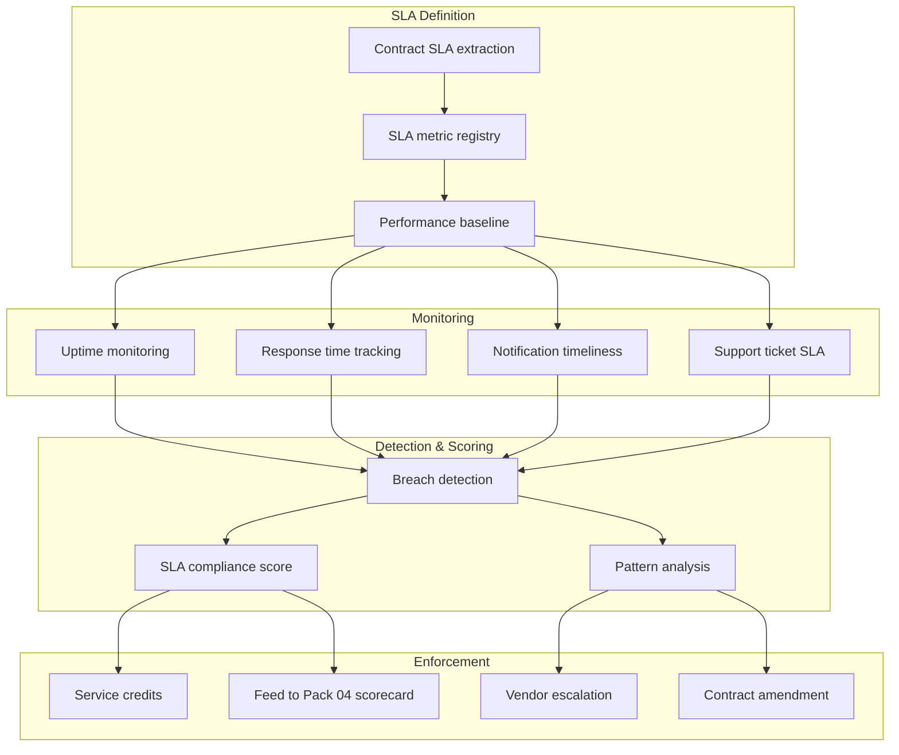

# SLA Governance & Monitoring Pack

> A Service Level Agreement that nobody monitors is a promise that nobody keeps. This pack turns SLAs from contract language into measured, scored, and enforced operational commitments.

[]()
[]()

---

> **Governance Notice** — This pack is governed by the [Stella Maris Constitution (CONST-01)](https://github.com/stella-maris-governance/smg-enterprise-hq) and enforces **POL-SC-01 (Supply Chain) · POL-QR-01 (Quality) · NIST SA-9**. All dispositions are subject to the Two-Person Integrity Protocol.

---

## Start Here

| You Are | Read This First |
|---------|----------------|
| **Hiring Manager** | This README then [`expected-vs-observed.md`](docs/expected-vs-observed.md) — proves vendor performance is measured, not assumed |
| **Consulting Client** | [`expected-vs-observed.md`](docs/expected-vs-observed.md) — when was the last time you measured a vendor against their SLA? |
| **Auditor / GRC** | [`expected-vs-observed.md`](docs/expected-vs-observed.md) then [`control-mapping.md`](docs/control-mapping.md) — NIST SA-4, SA-9, SR-3 alignment |
| **Defense Contractor** | SLA governance proves vendor accountability for mission-critical services |
| **Engineer** | [`/code/`](code/) for SLA tracking and breach detection then [`sla-operations-runbook.md`](docs/sla-operations-runbook.md) |

---

## The Problem

Every vendor contract has SLAs. 99.9% uptime. 4-hour incident response. 24-hour breach notification. 15-minute support response for Severity 1 tickets.

Nobody measures them.

The SLA lives in a contract PDF that legal negotiated, procurement signed, and nobody opened again. When the vendor has a 6-hour outage, nobody checks whether the SLA promised 4-hour recovery. When a security incident takes 7 days to disclose, nobody checks whether the contract required 48 hours. When support tickets sit unanswered for 3 days, nobody checks whether the SLA promised 15 minutes.

The SLA is the contract between what you're paying for and what you're receiving. If you're not measuring it, you're paying for a promise and accepting whatever you get.

In aerospace logistics, every supplier had delivery metrics: on-time delivery rate, defect rate, lead time variance. A supplier who dropped below 95% on-time delivery went on a Corrective Action Request. The same discipline applies to digital supply chain SLAs. You measure. You score. You enforce. Or you accept the risk that the promise isn't being kept.

---

## What This Pack Delivers

| Capability | What It Does | How |
|-----------|-------------|-----|
| **SLA extraction and registry** | Extract measurable SLA terms from every vendor contract | Structured registry with metric, target, measurement method, and penalty |
| **Performance monitoring** | Measure vendor actual performance against SLA commitments | Automated monitoring for uptime, response time, notification timeliness |
| **Breach detection** | Identify when a vendor fails to meet an SLA commitment | Threshold-based alerting with severity classification |
| **SLA scoring** | Score each vendor's SLA compliance as a percentage | Rolling 90-day compliance rate per SLA metric |
| **Pattern analysis** | Detect recurring SLA failures that indicate systemic issues | Trend analysis across breach types and frequencies |
| **Enforcement tracking** | Track SLA breach consequences: credits, penalties, escalations | Remediation log with financial impact |

---

## Architecture


---

## SLA Categories

### Category 1 — Availability

| Metric | Typical SLA | How to Measure | Breach Impact |
|--------|-------------|---------------|---------------|
| Uptime percentage | 99.9% (8.76 hrs/yr downtime) | Status page monitoring, synthetic checks, vendor-reported | Service credit trigger |
| Planned maintenance windows | Advance notice, off-peak hours | Vendor notification tracking | Process breach |
| Recovery Time Objective (RTO) | 4 hours | Incident-to-recovery measurement | Operational impact |
| Recovery Point Objective (RPO) | 1 hour | Data recovery validation | Data loss risk |

### Category 2 — Incident Response

| Metric | Typical SLA | How to Measure | Breach Impact |
|--------|-------------|---------------|---------------|
| Incident notification time | 24-48 hours | Timestamp: vendor-detected → vendor-notified-you | Trust breach — Pack 05 |
| Incident update frequency | Every 4 hours during active incident | Vendor communication log | Cooperation score |
| Root cause analysis delivery | 5-10 business days post-incident | Delivery date tracking | Accountability score |
| Post-incident report | 30 days post-incident | Delivery date tracking | Governance gap |

### Category 3 — Support

| Metric | Typical SLA | How to Measure | Breach Impact |
|--------|-------------|---------------|---------------|
| Severity 1 response time | 15 minutes | Ticket timestamp: creation → first response | Critical service degradation |
| Severity 2 response time | 1 hour | Ticket timestamp | Moderate operational impact |
| Severity 3 response time | 4 hours | Ticket timestamp | Minor operational impact |
| Resolution time by severity | Varies by contract | Ticket timestamp: creation → resolution | Prolonged exposure |

### Category 4 — Security & Compliance

| Metric | Typical SLA | How to Measure | Breach Impact |
|--------|-------------|---------------|---------------|
| Breach notification time | 48 hours (contractual) / 72 hours (GDPR) | Timestamp comparison: breach-detected → client-notified | Regulatory exposure — Pack 05 |
| Vulnerability remediation | Critical: 48 hrs, High: 7 days | Vendor advisory timeline | Pack 03 SBOM correlation |
| Attestation renewal | Before expiry | Pack 02 expiry tracking | Compliance gap |
| SBOM refresh | Per major release or quarterly | Pack 03 tracking | Supply chain visibility |

### Category 5 — Data & Operations

| Metric | Typical SLA | How to Measure | Breach Impact |
|--------|-------------|---------------|---------------|
| Data export/portability | Within 30 days of request | Request-to-delivery tracking | Vendor lock-in risk |
| Data deletion confirmation | Within 90 days of termination | Pack 08 offboarding tracking | Regulatory exposure |
| API rate limits | Per contract | API monitoring | Integration failure |
| Scheduled reporting | Monthly/quarterly | Delivery date tracking | Governance gap |

---

## SLA Compliance Scoring

Each vendor's SLA compliance is scored on a rolling 90-day window:

| Score | Status | Meaning |
|-------|--------|---------|
| 95-100% | **Exemplary** | All SLAs met or exceeded. No breaches. |
| 85-94% | **Compliant** | Minor breaches only. Vendor self-corrected. |
| 70-84% | **Underperforming** | Multiple breaches or recurring pattern. Vendor engagement required. |
| 50-69% | **Non-Compliant** | Systemic SLA failures. Escalation to vendor executive. Service credits triggered. |
| 0-49% | **Critical Breach** | Vendor consistently failing contractual obligations. Contract review and potential replacement. |

### Scoring Formula
```
SLA Compliance % = (SLA commitments met / total SLA commitments measured) × 100
```

Each SLA metric is weighted by category importance:
- Availability: 30%
- Incident Response: 25%
- Support: 15%
- Security & Compliance: 20%
- Data & Operations: 10%

> **Watchstander Note:** A vendor who hits 99.95% uptime but takes 7 days to notify you of a breach is not "compliant." They're meeting the easy metric and failing the critical one. The weighted scoring ensures that a security SLA breach costs more than a support SLA breach. What matters most weighs most.

---

## SLA Breach Severity

| Severity | Definition | Response |
|----------|-----------|----------|
| **Minor** | First occurrence of a non-critical SLA miss. Vendor self-corrects within reasonable timeframe. | Log. Monitor for pattern. |
| **Moderate** | Second occurrence of same SLA miss within 90 days, or first occurrence of a critical SLA miss. | Notify vendor relationship owner. Request corrective action. |
| **Major** | Third occurrence within 90 days, or critical SLA miss affecting operations or data. | Escalate to vendor executive. Trigger service credit review. Feed Pack 04 scorecard. |
| **Critical** | SLA breach resulting in data exposure, regulatory violation, or business interruption. | Activate Pack 05 incident response. CISO notification. Contract review. |

---

## Compliance Mapping

| Framework | Control ID | Control Name | Implementation |
|-----------|-----------|--------------|----------------|
| NIST 800-161 | SR-3 | Supply Chain Controls and Processes | SLA as supply chain accountability mechanism |
| NIST 800-53 | SA-4 | Acquisition Process | SLA requirements defined at procurement |
| NIST 800-53 | SA-9 | External System Services | Vendor performance monitoring against commitments |
| NIST 800-53 | SA-9(2) | Identification of Functions | SLA scope alignment with services used |
| CMMC L2 | SR.L2-3.17.1 | Supply Chain Risk Management | Vendor accountability through measured SLAs |

> Full mapping: [`docs/control-mapping.md`](docs/control-mapping.md)

---

## What's Included

### `code/` — Tracking, Scoring, and Enforcement

| File | Description |
|------|-------------|
| `sla-registry.json` | Registry: vendor, SLA category, metric, target, measurement method, penalty clause |
| `calculate-sla-compliance.py` | Python: 90-day rolling SLA compliance score per vendor |
| `sla-breach-tracker.json` | Breach log: vendor, metric, target, actual, severity, disposition |
| `sla-breach-detection.kql` | KQL: automated SLA breach detection from monitoring data |
| `sla-pattern-analysis.py` | Python: detect recurring SLA failures across time and category |
| `deploy-sla-monitoring.ps1` | PowerShell: configure SLA monitoring dashboards and alerts |

### `docs/` — SOPs, Runbooks, Evidence

| File | Description |
|------|-------------|
| [`expected-vs-observed.md`](docs/expected-vs-observed.md) | The Law of Evidence — 10 controls |
| [`sla-operations-runbook.md`](docs/sla-operations-runbook.md) | Full SLA governance SOP |
| [`control-mapping.md`](docs/control-mapping.md) | NIST 800-161 / 800-53 / CMMC alignment |

### `screenshots/` — Evidence

This pack uses **deterministic engine outputs** as primary evidence rather than portal screenshots.

| Evidence Type | Format | Purpose |
|--------------|--------|---------|
| Engine output (`.txt`) | Script terminal output | Primary — proves logic and methodology |
| Report output (`.md`) | Formatted engine report | Primary — proves analysis and findings |
| Portal screenshot (`.png`) | Azure portal capture | Secondary — added when running against live environment |

> See `EVIDENCE-README.md` in the screenshots directory for the full evidence approach.

---

## Deployment Guide

| Step | Action | Duration |
|------|--------|----------|
| 1 | Collect all vendor contracts and extract SLA terms | 4 hours |
| 2 | Build SLA registry with metrics, targets, and measurement methods | 3 hours |
| 3 | Configure uptime monitoring for Critical/High vendor services | 2 hours |
| 4 | Configure support ticket SLA tracking in ITSM tool | 2 hours |
| 5 | Map incident notification SLAs to Pack 05 timeline tracking | 1 hour |
| 6 | Map attestation renewal SLAs to Pack 02 expiry tracking | 30 min |
| 7 | Establish 90-day baseline for compliance scoring | 90 days (passive) |
| 8 | Configure breach detection alerts | 1 hour |
| 9 | Set monthly SLA review cadence | 30 min |
| 10 | Capture screenshots and complete E-v-O | 1 hour |

> **Watchstander Note:** Step 1 is where you discover that half your contracts don't have measurable SLAs. "Best effort" is not an SLA. "Reasonable timeframe" is not a metric. Document every contract that lacks specific, measurable commitments — that's your contract amendment list. You cannot govern what you cannot measure, and you cannot measure what isn't defined.

---

## Related Packs

| Pack | Relationship |
|------|-------------|
| [Vendor Risk Assessment](../01-vendor-risk-assessment/) | SLA compliance feeds re-assessment conversations |
| [Attestation Validation](../02-attestation-validation/) | Attestation renewal timeliness is an SLA metric |
| [SBOM Governance](../03-sbom-governance/) | SBOM refresh timeliness is an SLA metric |
| [Vendor Security Scorecard](../04-vendor-security-scorecard/) | SLA compliance score feeds Relationship Health category (15%) |
| [Supply Chain Incident Response](../05-supply-chain-incident-response/) | Incident notification timeliness scored against SLA |
| [Tier 2/3 Traceability](../06-tier2-tier3-traceability/) | Subprocessor change notification is an SLA metric |
| [Vendor Offboarding](../08-vendor-offboarding/) | Data deletion and export SLAs enforced during offboarding |

---

## Changelog

| Version | Date | Change |
|---------|------|--------|
| 1.0.0 | 2026-02-12 | Initial release |

---

<div align="center">

**© 2026 Stella Maris Governance LLC**

*The work speaks for itself. Stella Maris — the one light that does not drift.*

</div>
