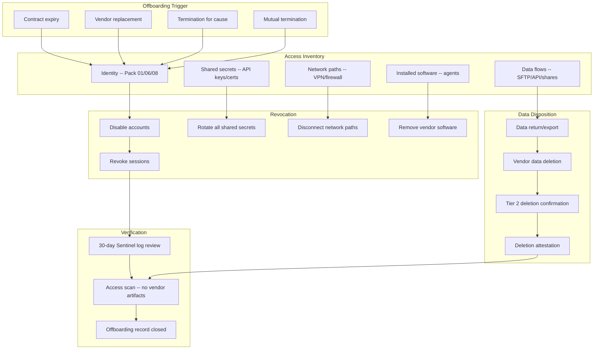

# Vendor Offboarding & Access Revocation Pack

> A vendor relationship ends the way it began — with a checklist. But the offboarding checklist matters more, because everything you gave them access to during the relationship must now be accounted for, revoked, and confirmed. The door you opened must close completely.

---

## Start Here

| You Are | Read This First |
|---------|----------------|
| **Hiring Manager** | This README then [`expected-vs-observed.md`](docs/expected-vs-observed.md) — proves vendor access doesn't persist after the relationship ends |
| **Consulting Client** | [`expected-vs-observed.md`](docs/expected-vs-observed.md) — how many former vendor accounts are still active in your environment right now? |
| **Auditor / GRC** | [`expected-vs-observed.md`](docs/expected-vs-observed.md) then [`control-mapping.md`](docs/control-mapping.md) — NIST PS-4, SA-9, SR-3 alignment |
| **Defense Contractor** | CMMC requires access revocation upon termination. This is the evidence. |
| **Engineer** | [`/code/`](code/) for offboarding automation and verification then [`offboarding-operations-runbook.md`](docs/offboarding-operations-runbook.md) |

---

## The Problem

Vendor onboarding gets a project plan, a kickoff meeting, and a deployment timeline. Vendor offboarding gets a cancellation email and a hope that someone remembers to disable the accounts.

When a vendor relationship ends — whether by contract expiry, replacement, dissatisfaction, or termination for cause — there is a window between "we decided to leave" and "all access is actually revoked." In that window, every account, API key, VPN tunnel, shared credential, data feed, and network path the vendor ever had is still live. If the offboarding is a termination for cause after a security incident, that window is a liability measured in minutes.

In a physical supply chain, when you terminate a supplier, you stop accepting shipments, return their tooling, revoke their facility badges, change the locks on the receiving dock, and verify they returned all your proprietary drawings. The digital equivalent requires the same discipline — except the "badges" are service principals, the "tooling" is API keys, and the "proprietary drawings" are your data sitting in their environment.

This pack builds the offboarding. Every access path documented during the relationship (Pack 01 intake, Pack 05 blast radius inventory, Pack 06 guest identity register) feeds the revocation checklist. Nothing is assumed revoked. Everything is verified.

---

## What This Pack Delivers

| Capability | What It Does | How |
|-----------|-------------|-----|
| **Structured offboarding checklist** | Every access path identified and revoked with verification | Cross-pillar checklist from identity, network, data, and software inventories |
| **Access revocation automation** | Automated disabling of vendor accounts and service principals | Playbook: disable accounts, revoke sessions, rotate credentials |
| **Data disposition governance** | Ensure your data is returned or destroyed by the vendor | Data deletion confirmation with attestation requirement |
| **Tier 2 data traceability** | Confirm data deletion extends through Tier 2 subprocessors | Pack 06 register feeds Tier 2 data disposition requirements |
| **Certificate and secret rotation** | All shared credentials rotated post-offboarding | Rotation checklist with verification |
| **Offboarding verification audit** | Independent verification that all access has been revoked | 30-day post-offboarding audit with Sentinel log review |

---

## Architecture

---

## Offboarding Triggers

| Trigger | Urgency | Special Considerations |
|---------|---------|----------------------|
| **Contract expiry** | Planned. Start offboarding 30 days before expiry. | Standard process. Vendor cooperation expected. |
| **Vendor replacement** | Planned. Overlap period for migration. | Ensure new vendor is operational before revoking old. Data migration verified. |
| **Mutual termination** | Semi-planned. Negotiate offboarding timeline. | Vendor cooperation expected. Data return SLA applies (Pack 07). |
| **Termination for cause** | Immediate. Revoke access same day. | Vendor may be uncooperative. Use Pack 05 containment playbook for access revocation. Data return may require legal enforcement. |
| **Vendor acquisition** | Assess. New entity may not meet your requirements. | Re-assess under Pack 01. If new entity fails assessment, trigger offboarding. |

> **Watchstander Note:** Termination for cause is the hardest offboarding because the vendor may not cooperate. Data return is uncertain. Deletion attestation may never come. This is where your right-to-audit clause (Pack 06) and your contractual data disposition terms (Pack 07) earn their value. Without them, you're asking. With them, you're requiring.

---

## Offboarding Checklist

### Phase 1 — Access Revocation (Day 0)

| # | Action | Source | Verification |
|---|--------|--------|-------------|
| 1 | Disable all vendor guest accounts in Entra ID | Pack 06 guest register | Entra audit log: AccountDisabled event |
| 2 | Disable all vendor service principals | Pack 08 CIEM register | Entra audit log: ServicePrincipalDisabled |
| 3 | Revoke all active sessions | Containment playbook | Graph API: revokeSignInSessions |
| 4 | Remove vendor from all Entra ID groups | Pack 04/06 access mapping | Group membership audit |
| 5 | Revoke all OAuth app consents granted to vendor | Entra enterprise apps | Consent audit log |
| 6 | Disable/delete vendor SSO integration | Identity team | SSO configuration audit |
| 7 | Terminate VPN tunnel (if applicable) | Network inventory | Firewall rule audit |
| 8 | Disable SFTP/file transfer channels | Data flow inventory | Transfer log verification |
| 9 | Revoke firewall rules permitting vendor IP ranges | Network inventory | Firewall rule audit |
| 10 | Remove vendor from conditional access exclusions | Pack 03 CA policy | CA policy audit |

### Phase 2 — Secret Rotation (Days 0-3)

| # | Action | Verification |
|---|--------|-------------|
| 11 | Rotate all API keys the vendor had access to | New key functional, old key returns 401 |
| 12 | Rotate all shared passwords/secrets | Secret manager audit log |
| 13 | Rotate certificates used for vendor integration | Certificate thumbprint changed |
| 14 | Rotate storage access keys (if vendor had blob/storage access) | Storage access key version changed |
| 15 | Revoke and regenerate any SAS tokens issued to vendor | Token validation test |

### Phase 3 — Software Removal (Days 0-7)

| # | Action | Verification |
|---|--------|-------------|
| 16 | Uninstall vendor agents from all endpoints | Endpoint inventory scan: agent absent |
| 17 | Remove vendor software from servers | Server inventory scan |
| 18 | Remove vendor-installed browser extensions | Endpoint policy check |
| 19 | Remove vendor DNS/CNAME records | DNS zone audit |
| 20 | Remove vendor webhook/callback URLs | Application configuration audit |

### Phase 4 — Data Disposition (Days 0-90)

| # | Action | SLA | Verification |
|---|--------|-----|-------------|
| 21 | Request data return/export from vendor | Per contract (Pack 07: typically 14-30 days) | Data received and validated |
| 22 | Request vendor confirm deletion of your data | Per contract (Pack 07: typically 90 days) | Written deletion attestation |
| 23 | Request Tier 2 subprocessor data deletion confirmation | Via Tier 1 vendor (Pack 06) | Tier 2 deletion attestation |
| 24 | Verify no residual data in vendor-accessible locations | Internal audit | Storage/share scan |
| 25 | Archive offboarding record with all evidence | Risk Owner | Record complete |

### Phase 5 — Verification Audit (Day 30)

| # | Action | Verification |
|---|--------|-------------|
| 26 | Sentinel log review: any vendor account activity post-offboarding? | Zero sign-in events from vendor accounts/IPs |
| 27 | DNS resolution check: any vendor-related records still resolving? | DNS clean |
| 28 | Network scan: any vendor IP ranges still permitted? | Firewall rules clean |
| 29 | Application audit: any vendor integrations still active? | Integration inventory clean |
| 30 | Offboarding record closure | All 29 items verified |

---

## Data Disposition Requirements

| Vendor Tier | Data Return | Deletion Confirmation | Tier 2 Deletion |
|------------|-------------|----------------------|-----------------|
| **Critical** | Required. Full data export in usable format. | Written attestation within 90 days. Must include: scope of deletion, systems affected, method of destruction, authorized signer. | Required from all Tier 2 entities handling your data (Pack 06 register). |
| **High** | Required. Data export in agreed format. | Written attestation within 90 days. | Requested. If Tier 2 entities known (Pack 06), include in deletion request. |
| **Medium** | Requested. Best-effort export. | Email confirmation acceptable. | Not required. |
| **Low** | Not required unless data shared. | Not required unless data shared. | Not required. |

> **Watchstander Note:** A deletion attestation is the supply chain equivalent of a Certificate of Destruction. In aerospace, when you destroy a defective part, you document the destruction: part number, serial, method, witness, date. Data destruction deserves the same rigor. "We deleted it" in an email is not an attestation. A signed statement with scope, method, and systems is.

---

## Compliance Mapping

| Framework | Control ID | Control Name | Implementation |
|-----------|-----------|--------------|----------------|
| NIST 800-161 | SR-3 | Supply Chain Controls and Processes | Vendor lifecycle closure with data disposition |
| NIST 800-53 | PS-4 | Personnel Termination | Access revocation upon vendor relationship termination |
| NIST 800-53 | SA-9 | External System Services | Offboarding verification: no residual vendor access |
| NIST 800-53 | MP-6 | Media Sanitization | Data deletion attestation from vendor |
| NIST 800-53 | AC-2 | Account Management | Vendor account lifecycle: disable on offboarding |
| CMMC L2 | AC.L2-3.1.1 | Authorized Access Control | Vendor access terminated upon relationship end |
| CMMC L2 | PS.L2-3.9.2 | Personnel Actions | Access revocation on termination |
| GDPR | Art. 17 | Right to Erasure | Data deletion confirmation from processor |
| GDPR | Art. 28(3)(g) | Processor obligations | Data return/deletion at end of processing |

> Full mapping: [`docs/control-mapping.md`](docs/control-mapping.md)

---

## What's Included

### `code/` — Automation, Checklists, and Verification

| File | Description |
|------|-------------|
| `offboarding-checklist.json` | 30-item checklist with phases, verification steps, and SLAs |
| `revoke-vendor-access.py` | Python: automated access revocation via Graph API |
| `offboarding-register.json` | Register: vendor, trigger, start date, phase status, completion |
| `post-offboarding-audit.kql` | KQL: 30-day post-offboarding activity scan for vendor artifacts |
| `data-disposition-tracker.json` | Tracker: data return, deletion request, attestation status by vendor |
| `deploy-offboarding-automation.ps1` | PowerShell: deploy offboarding Logic App and verification scheduled tasks |

### `docs/` — SOPs, Runbooks, Evidence

| File | Description |
|------|-------------|
| [`expected-vs-observed.md`](docs/expected-vs-observed.md) | The Law of Evidence — 10 controls |
| [`offboarding-operations-runbook.md`](docs/offboarding-operations-runbook.md) | Full offboarding SOP |
| [`control-mapping.md`](docs/control-mapping.md) | NIST 800-161 / 800-53 / CMMC / GDPR alignment |
| [`data-deletion-attestation-template.md`](docs/data-deletion-attestation-template.md) | Template for vendor data destruction certificate |

### `screenshots/` — Evidence

This pack uses **deterministic engine outputs** as primary evidence rather than portal screenshots.

| Evidence Type | Format | Purpose |
|--------------|--------|---------|
| Engine output (`.txt`) | Script terminal output | Primary — proves logic and methodology |
| Report output (`.md`) | Formatted engine report | Primary — proves analysis and findings |
| Portal screenshot (`.png`) | Azure portal capture | Secondary — added when running against live environment |

> See `EVIDENCE-README.md` in the screenshots directory for the full evidence approach.

---

## Deployment Guide

| Step | Action | Duration |
|------|--------|----------|
| 1 | Compile all vendor access inventories from Packs 01, 05, 06, 08 (CIEM) | 2 hours |
| 2 | Build master offboarding checklist per vendor with all access paths | 2 hours per vendor |
| 3 | Deploy automated access revocation script | 2 hours |
| 4 | Configure post-offboarding audit KQL query | 1 hour |
| 5 | Customize data deletion attestation template | 1 hour |
| 6 | Build offboarding register | 1 hour |
| 7 | Run tabletop: simulate planned vendor offboarding | 2 hours |
| 8 | Run tabletop: simulate termination-for-cause offboarding | 2 hours |
| 9 | Document tabletop results and refine process | 1 hour |
| 10 | Capture screenshots and complete E-v-O | 1 hour |

> **Watchstander Note:** Steps 7 and 8 test two fundamentally different scenarios. A planned offboarding is cooperative — the vendor helps you migrate and provides deletion attestation. A termination for cause is adversarial — the vendor may not cooperate, and you're relying on your own access revocation and your contractual rights. You must be ready for both.

---

## Related Packs

| Pack | Relationship |
|------|-------------|
| [Vendor Risk Assessment](../01-vendor-risk-assessment/) | Pack 01 intake form documents all access granted — feeds offboarding checklist |
| [Attestation Validation](../02-attestation-validation/) | Attestation records archived post-offboarding |
| [SBOM Governance](../03-sbom-governance/) | Vendor software removed from SBOM register post-offboarding |
| [Vendor Security Scorecard](../04-vendor-security-scorecard/) | Scorecard archived. Vendor removed from active monitoring. |
| [Supply Chain Incident Response](../05-supply-chain-incident-response/) | Termination-for-cause uses Pack 05 containment playbook for immediate access revocation |
| [Tier 2/3 Traceability](../06-tier2-tier3-traceability/) | Tier 2 data deletion confirmation required for Critical vendors |
| [SLA Governance](../07-sla-governance/) | Data return and deletion SLAs enforced during offboarding |
| [Zero-Touch JML (Identity Pack 01)](../../identity-iga-packs/01-zero-touch-jml-lifecycle/) | Vendor guest account lifecycle: offboarding triggers leaver event |
| [Guest Identity (Identity Pack 06)](../../identity-iga-packs/06-guest-vendor-iam/) | Guest identity register is primary source for vendor account inventory |

---

## Changelog

| Version | Date | Change |
|---------|------|--------|
| 1.0.0 | 2026-02-12 | Initial release |

---

**© 2026 Stella Maris Governance LLC**

*The work speaks for itself. Stella Maris — the one light that does not drift.*

